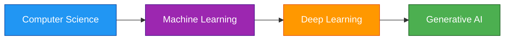
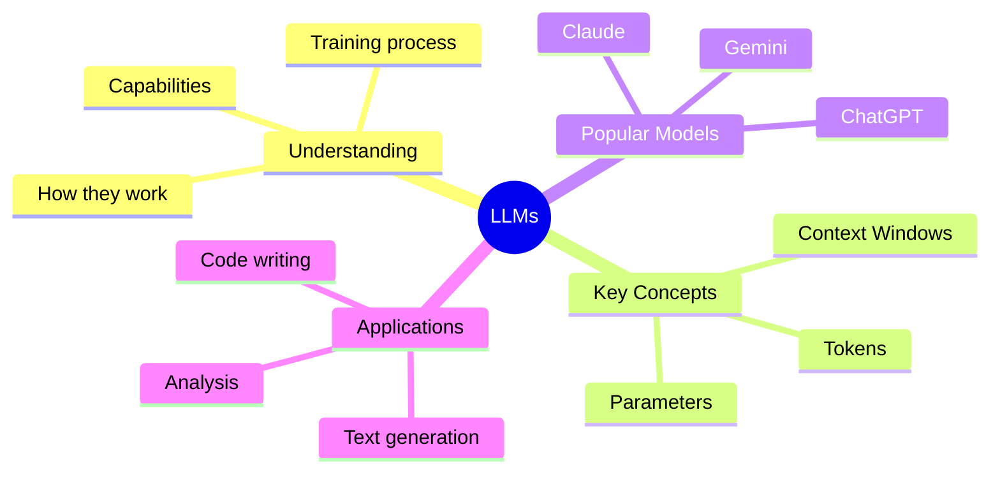
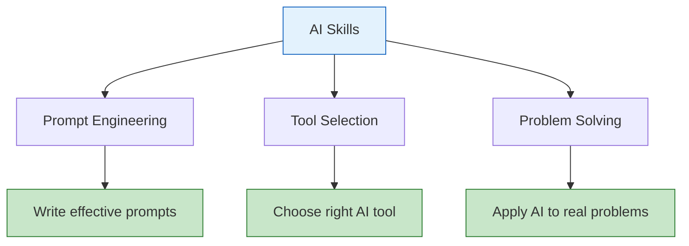
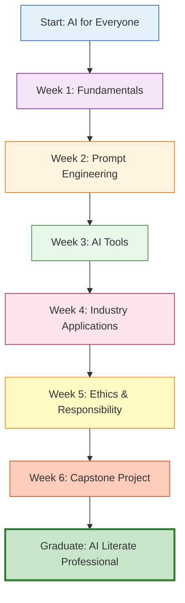
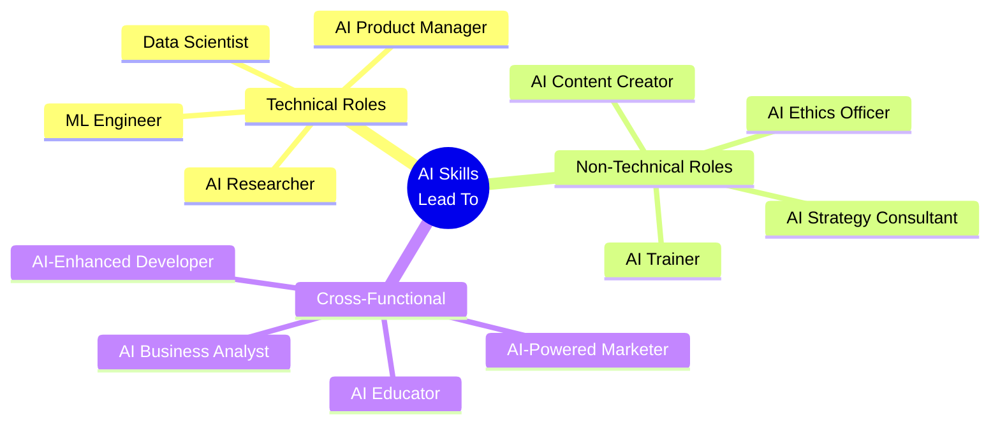

# 🤖 AI for Everyone

**Instructor:** Waqar Rana

**Course Incharge:** Muzammil Bilwani

---

## 📘 Course Overview

This repository contains comprehensive learning materials for the **AI for Everyone** course - designed to make Artificial Intelligence accessible to everyone, regardless of technical background.

This course provides a **fundamental understanding of AI, Machine Learning, Deep Learning, and Generative AI** with a focus on practical knowledge and real-world applications. You'll learn how AI works, what it can do, and how to leverage it effectively in various domains.

By the end of this course, you will understand AI concepts, be able to use AI tools effectively, and know how to apply AI solutions to real-world problems.

---

## 📋 Prerequisites

This course is designed for everyone:

* ✅ **No programming experience required**
* ✅ Basic computer literacy (browsing, using apps)
* ✅ Interest in learning about AI and its applications
* ✅ Willingness to explore AI tools hands-on

---

## 🎯 Learning Outcomes

By the end of this course, you will be able to:

* 🧠 Understand **fundamental AI concepts** - CS, ML, DL, and Generative AI
* 🤖 Explain how **Large Language Models (LLMs)** work
* 💬 Master **prompt engineering** for effective AI interaction
* 🔧 Use **popular AI tools** like ChatGPT, Gemini, and Claude
* 📊 Apply AI to **real-world problems** across different industries
* ⚖️ Understand **AI ethics, bias, and limitations**
* 🚀 Leverage AI to **boost productivity** in your work
* 🎯 Make informed decisions about **when and how to use AI**

---

## 🧭 Course Outline

### Week 1: Introduction to AI & Fundamentals
**Understanding the AI Landscape**

| Class | Topics Covered | Key Concepts |
|-------|---------------|--------------|
| **Class 1** | • What is Artificial Intelligence?<br/>• PATH to AI: CS → ML → DL → Gen AI<br/>• Real-world AI applications | • Computer Science foundation<br/>• Machine Learning basics<br/>• Deep Learning networks<br/>• Generative AI explained |
| **Class 2** | • Large Language Models (LLMs)<br/>• Understanding Tokens<br/>• Context Windows<br/>• Parameters in AI models | • How LLMs work<br/>• Token calculation<br/>• Context limits<br/>• Popular LLMs comparison |

**📁 [Week 1 Content](./week_1/)**

---

### Week 2: Prompt Engineering (Coming Soon)
**Mastering AI Communication**

- Zero-shot prompting
- Few-shot prompting
- Chain-of-thought reasoning
- Prompt templates and best practices
- Effective prompt writing techniques

---

### Week 3: AI Tools & Applications (Coming Soon)
**Hands-on with AI Platforms**

- ChatGPT deep dive
- Google Gemini exploration
- Claude and other LLMs
- AI for productivity
- AI for content creation

---

### Week 4: AI in Different Industries (Coming Soon)
**Real-World Applications**

- AI in Healthcare
- AI in Finance
- AI in Education
- AI in Marketing
- AI in Software Development

---

### Week 5: AI Ethics & Responsible Use (Coming Soon)
**Understanding AI's Impact**

- AI bias and fairness
- Privacy concerns
- Ethical considerations
- AI limitations
- Future of AI

---

### Week 6: Capstone Project (Coming Soon)
**Apply Your Knowledge**

- Design an AI solution for a real problem
- Create effective prompts
- Evaluate AI outputs
- Present your project

---

## 🧩 Course Structure

Each week follows this structure:

```
Week_X/
├── class_1/
│   ├── README.md          # Detailed lecture notes
│   ├── images/            # Visual diagrams
│   └── examples/          # Practical examples
└── class_2/
    ├── README.md          # Detailed lecture notes
    ├── images/            # Visual diagrams
    └── examples/          # Practical examples
```

### What Each Class Includes:

- ✅ **Detailed explanations** with real-world examples
- ✅ **Visual diagrams** using Mermaid for better understanding
- ✅ **Hands-on exercises** to practice concepts
- ✅ **Practice questions** for self-assessment
- ✅ **Key takeaways** summarizing important points
- ✅ **Next class preview** to prepare ahead

---

## 🧠 Key Topics Breakdown

### 1. AI Fundamentals



### 2. Large Language Models (LLMs)



### 3. Practical Skills



---

## 🛠️ Tools & Technologies Covered

### AI Platforms:
- **ChatGPT** (OpenAI)
- **Google Gemini** (Google)
- **Claude** (Anthropic)
- **Microsoft Copilot**
- **Perplexity AI**

### AI Tools for Different Tasks:
- **Text Generation**: ChatGPT, Gemini, Claude
- **Image Generation**: DALL-E, Midjourney, Stable Diffusion
- **Code Assistance**: GitHub Copilot, Amazon CodeWhisperer
- **Productivity**: Notion AI, Grammarly, Jasper
- **Research**: Perplexity, Consensus, Elicit

---

## 📊 Grading Criteria

| **Component** | **Percentage** | **Details** |
|---------------|----------------|-------------|
| Quizzes | 20% | Weekly concept checks |
| Class Participation | 15% | Active engagement and discussions |
| Assignments | 25% | Practical exercises and tool usage |
| Final Project | 40% | Capstone project demonstrating AI application |
| **Total** | **100%** | |

---

## 💡 Hands-on Practice

Each week includes practical exercises:

### Week 1 Activities:
- ✍️ Identify AI applications in daily life
- 🔢 Practice token calculation
- 🤔 Compare different LLMs
- 📝 Understand context windows through examples

### Upcoming Activities:
- Writing effective prompts
- Using ChatGPT for different tasks
- Creating content with AI
- Solving problems with AI assistance
- Building an AI-powered solution

---

## 🌟 Why This Course?

### For Non-Technical Learners:
- ✅ **No coding required** - Focus on concepts and usage
- ✅ **Simple explanations** with real-world analogies
- ✅ **Visual learning** with diagrams and examples
- ✅ **Practical approach** - Learn by doing

### For Technical Learners:
- ✅ **Deep understanding** of how AI works
- ✅ **Technical concepts** explained clearly
- ✅ **Architecture insights** into LLMs
- ✅ **Best practices** for AI implementation

### For Everyone:
- ✅ **Career boost** - AI skills are in high demand
- ✅ **Productivity gains** - Work smarter with AI
- ✅ **Future-ready** - Understand the technology shaping tomorrow
- ✅ **Community learning** - Collaborate with peers

---

## 📚 Additional Resources

### Recommended Reading:
- OpenAI Documentation
- Google AI Blog
- Anthropic Research Papers
- AI Alignment Forum

### Practice Platforms:
- ChatGPT Playground
- Google AI Test Kitchen
- Hugging Face Spaces
- Replicate

### Communities:
- AI Discord Servers
- Reddit: r/artificial, r/ChatGPT
- Twitter AI Community
- LinkedIn AI Groups

---

## 🎯 Learning Path Visualization



---

## 💼 Career Opportunities

Understanding AI opens doors to various roles:



---

## 🤝 Contribution Guidelines

Want to contribute to this course material?

1. **Fork** this repository
2. **Create a branch** for your improvements
   ```bash
   git checkout -b feature/your-improvement
   ```
3. **Make changes** with clear documentation
4. **Commit** with descriptive messages
   ```bash
   git commit -m "Add: explanation of transformers architecture"
   ```
5. **Submit a Pull Request** with details

### Contribution Ideas:
- Add more examples and use cases
- Create additional diagrams
- Suggest new practice questions
- Share real-world applications
- Improve explanations
- Add multilingual content

---

## 📫 Contact & Support

For course-related queries, feedback, or collaboration:

📧 **Email:** [waqarahmed7861234@gmail.com](mailto:waqarahmed7861234@gmail.com)

💼 **GitHub:** [https://github.com/Maksof-waqarahmed](https://github.com/Maksof-waqarahmed)

🌐 **LinkedIn:** [https://www.linkedin.com/in/waqarranadev/](https://www.linkedin.com/in/waqarranadev/)

---

## 🚀 Get Started

### Quick Start Guide:

1. **Clone the repository:**
   ```bash
   git clone https://github.com/your-username/Bano-Qabil.git
   cd Bano-Qabil/AI-For-Everyone
   ```

2. **Start with Week 1:**
   ```bash
   cd week_1/class_1
   # Read README.md
   ```

3. **Follow the sequence:**
   - Complete Class 1
   - Do practice questions
   - Move to Class 2
   - Complete weekly quiz

4. **Practice hands-on:**
   - Try ChatGPT examples
   - Experiment with prompts
   - Apply concepts to your work

---

## 📈 Course Progress Tracker

### Week 1: Introduction to AI ✅
- ✅ Class 1: AI PATH (CS → ML → DL → Gen AI)
- ✅ Class 2: LLMs, Tokens, Context Windows

### Week 2: Prompt Engineering ⏳
- ⏳ Coming Soon

### Week 3: AI Tools & Applications ⏳
- ⏳ Coming Soon

### Week 4: Industry Applications ⏳
- ⏳ Coming Soon

### Week 5: Ethics & Responsibility ⏳
- ⏳ Coming Soon

### Week 6: Capstone Project ⏳
- ⏳ Coming Soon

---

## 🎓 Certificate

Upon successful completion of the course:
- ✅ Complete all weekly quizzes
- ✅ Submit all assignments
- ✅ Finish capstone project
- ✅ Participate actively in classes

You will receive:
- 🏆 **Bano Qabil AI for Everyone Certificate**
- 📜 **Digital badge** for LinkedIn
- 💼 **Portfolio project** to showcase

---

## 🌟 Success Stories

*This section will feature success stories from students who completed the course and applied AI in their work*

---

## 📝 Course Updates

This course is continuously updated with:
- Latest AI developments
- New tools and platforms
- Updated examples
- Community contributions
- Industry best practices

**Last Updated:** April 2026

**Current Version:** 1.0

---

## 🎉 Join the AI Revolution

Artificial Intelligence is transforming every industry. This course will help you:

- 🎯 **Understand** what AI can and cannot do
- 🛠️ **Use** AI tools effectively
- 💡 **Apply** AI to solve real problems
- 🚀 **Stay ahead** in your career
- 🤝 **Join** a community of AI enthusiasts

**Start your AI journey today!**

---

**Happy Learning! 🤖**

*Making AI accessible to everyone, one concept at a time.*

---

*Brought to you by **Bano Qabil** - Empowering Pakistan with Free IT Education* 💙
