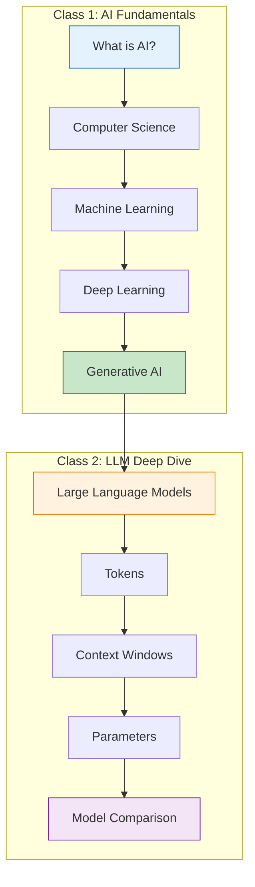
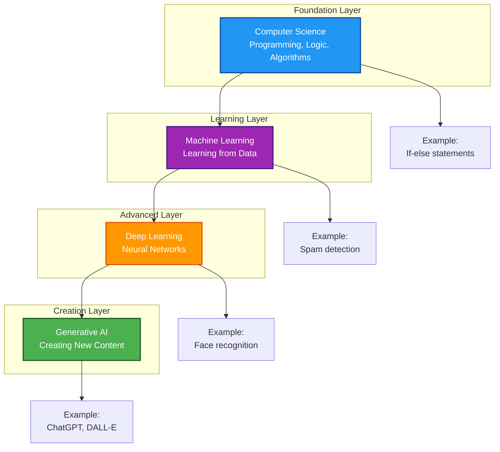
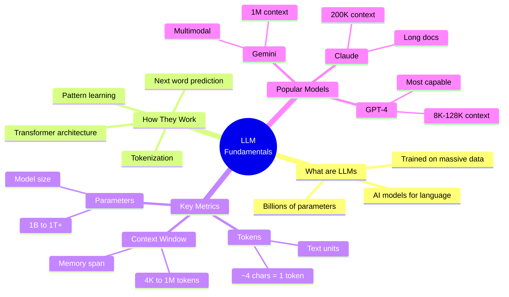
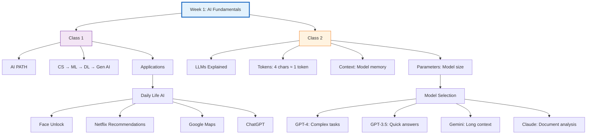
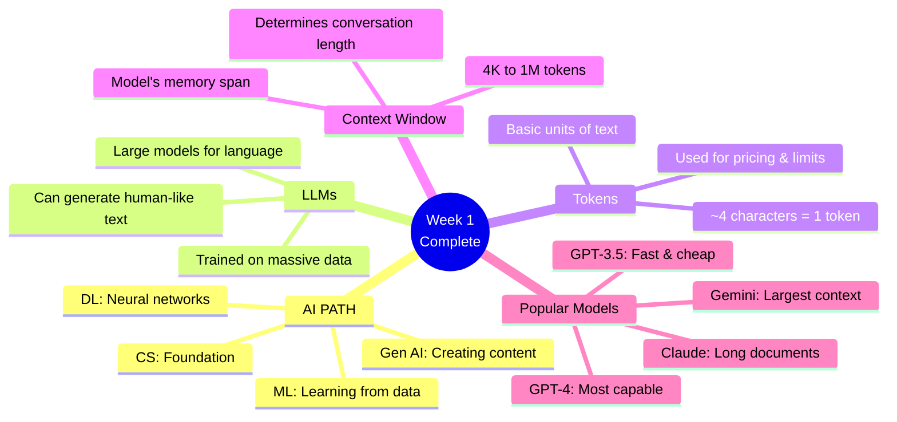
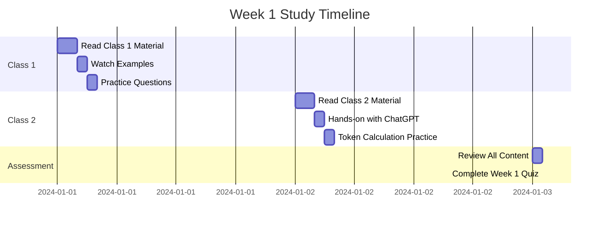

# Week 1: Introduction to Artificial Intelligence

**Complete Overview of AI Fundamentals**

---

## Week 1 Summary

This week covers the foundational concepts of Artificial Intelligence, from basic Computer Science to advanced Generative AI, along with understanding how Large Language Models work.

---

## Class Structure

### [Class 1: Introduction to AI & The PATH](./class_1/README.md)

**Topics Covered:**
- What is Artificial Intelligence?
- The PATH to AI: CS → ML → DL → Gen AI
- Computer Science Foundation
- Machine Learning Explained
- Deep Learning and Neural Networks
- Generative AI Revolution
- Real-world Applications

**Key Diagrams:**
- AI Evolution Pyramid
- Machine Learning Types
- Neural Network Architecture
- Generative AI vs Traditional AI

**Duration:** 1.5 - 2 hours

---

### [Class 2: LLMs, Tokens & Context Windows](./class_2/README.md)

**Topics Covered:**
- Large Language Models (LLMs)
- How LLMs Work
- Understanding Tokens
- Context Windows Explained
- Parameters in AI Models
- Popular LLMs Comparison
- Practical Examples and Limitations

**Key Diagrams:**
- LLM Training Process
- Token Calculation Flow
- Context Window Visualization
- Parameter Comparison

**Duration:** 1.5 - 2 hours

---

## Complete Week 1 Learning Path

---

## Key Concepts Overview

### The AI Hierarchy

---

## LLM Core Concepts

---

## Week 1 Visual Summary

---

## Learning Objectives - Week 1

By the end of Week 1, you will be able to:

### Knowledge & Understanding:
- ✅ Define Artificial Intelligence and its components
- ✅ Explain the progression from CS to ML to DL to Gen AI
- ✅ Describe how Large Language Models work
- ✅ Understand the concept of tokens and context windows
- ✅ Compare different AI models and their use cases

### Skills:
- ✅ Calculate approximate token counts for text
- ✅ Select appropriate AI models for different tasks
- ✅ Recognize AI applications in daily life
- ✅ Understand context limitations of LLMs

### Attitudes:
- ✅ Appreciate the power and potential of AI
- ✅ Recognize the limitations of current AI systems
- ✅ Develop critical thinking about AI outputs
- ✅ Build curiosity about AI technology

---

## Practice & Assessment

### Week 1 Quiz Topics:

1. **AI Fundamentals**
   - What is AI?
   - Difference between ML and DL
   - Types of Machine Learning
   - Generative AI examples

2. **LLM Concepts**
   - What are tokens?
   - Context window definition
   - Parameter significance
   - Model comparison

3. **Practical Application**
   - Token estimation
   - Model selection for tasks
   - Real-world AI identification

---

## Hands-on Exercises

### Exercise 1: AI Spotting
Identify 10 AI applications you use/encounter daily:
- Categorize them: ML, DL, or Gen AI
- Explain how they help you
- Rate their usefulness (1-10)

### Exercise 2: Token Practice
Calculate approximate tokens for:
1. "Hello, how are you?"
2. A 500-word essay
3. A 10-page document
4. Your favorite book

### Exercise 3: Model Selection
Choose the best model for:
1. Translating a sentence
2. Analyzing a 100-page research paper
3. Quick Q&A chatbot
4. Generating creative stories

### Exercise 4: Context Understanding
Scenario: You have GPT-3.5 (4K context)
1. How many messages can fit?
2. What happens when limit is reached?
3. How to manage long conversations?

---

## Key Takeaways - Week 1

---

## Real-World Applications Discussed

### Class 1 Examples:
- **Email Spam Detection** (ML)
- **Face Recognition** (DL)
- **ChatGPT Conversations** (Gen AI)
- **Self-driving Cars** (DL)
- **Netflix Recommendations** (ML)

### Class 2 Examples:
- **Token Calculation** for cost estimation
- **Context Management** in long conversations
- **Model Selection** based on task requirements
- **LLM Limitations** and workarounds

---

## Common Questions & Answers

### Q1: Do I need programming skills to understand this?
**A:** No! Week 1 is designed for everyone. We use simple analogies and visual diagrams.

### Q2: Which AI model should I use?
**A:** Depends on your task:
- Quick answers → GPT-3.5
- Complex reasoning → GPT-4
- Long documents → Claude or Gemini

### Q3: Why are tokens important?
**A:** Tokens determine:
- Cost (charged per token)
- Speed (more tokens = slower)
- Limits (context window in tokens)

### Q4: Can AI replace humans?
**A:** AI is a tool that augments human capabilities, not replaces them. It has limitations like hallucinations, bias, and no true understanding.

---

## Week 1 Timeline

### Suggested Study Plan:

**Total Time:** 10-12 hours

---

## Resources & Tools

### For This Week:

1. **AI Tools to Explore:**
   - ChatGPT (https://chat.openai.com)
   - Google Gemini (https://gemini.google.com)
   - Claude (https://claude.ai)

2. **Token Calculators:**
   - OpenAI Tokenizer: https://platform.openai.com/tokenizer
   - Calculate token counts for practice

3. **Additional Reading:**
   - OpenAI Blog
   - Google AI Blog
   - Anthropic Research

---

## Next Week Preview

### Week 2: Prompt Engineering

You will learn:
- What is Prompt Engineering?
- Zero-shot vs Few-shot prompting
- Chain-of-thought reasoning
- Prompt templates and patterns
- Best practices for effective prompts
- Hands-on prompt writing exercises

**Get Ready!**

---

## Week 1 Checklist

Before moving to Week 2, ensure you have:

- [ ] Completed Class 1 reading
- [ ] Understood the AI PATH (CS → ML → DL → Gen AI)
- [ ] Completed Class 2 reading
- [ ] Practiced token calculation
- [ ] Explored at least 2 LLMs (ChatGPT, Gemini, etc.)
- [ ] Completed practice questions
- [ ] Finished Week 1 quiz (if available)
- [ ] Reviewed key concepts

---

## Need Help?

If you have questions or need clarification:

1. **Review the diagrams** - Visual aids explain complex concepts
2. **Try the examples** - Hands-on practice reinforces learning
3. **Ask in discussions** - Community can help
4. **Contact instructor** - waqarahmed7861234@gmail.com

---

## Congratulations! 🎉

You've completed **Week 1 of AI for Everyone**!

You now understand:
- ✅ What AI is and how it evolved
- ✅ The difference between ML, DL, and Gen AI
- ✅ How Large Language Models work
- ✅ What tokens and context windows are
- ✅ How to choose the right AI model

**Keep the momentum going! See you in Week 2!** 🚀

---

*Happy Learning!*

**Instructor:** Waqar Rana
**Course:** AI for Everyone - Bano Qabil
