# Week 1 - Class 1: Introduction to Artificial Intelligence

## Table of Contents
1. [What is Artificial Intelligence?](#what-is-artificial-intelligence)
2. [PATH to AI: Understanding the Journey](#path-to-ai-understanding-the-journey)
3. [Computer Science (CS)](#computer-science-cs)
4. [Machine Learning (ML)](#machine-learning-ml)
5. [Deep Learning (DL)](#deep-learning-dl)
6. [Generative AI (Gen AI)](#generative-ai-gen-ai)
7. [AI Evolution Timeline](#ai-evolution-timeline)
8. [Real-World Applications](#real-world-applications)
9. [Practice Questions](#practice-questions)

---

## What is Artificial Intelligence?

**Artificial Intelligence (AI)** is the simulation of human intelligence in machines that are programmed to think, learn, and make decisions like humans.

### Simple Definition:
> AI enables computers to perform tasks that typically require human intelligence, such as:
> - Understanding language
> - Recognizing images
> - Making decisions
> - Solving problems
> - Learning from experience

### Real-Life Example:
Think of **Siri** or **Google Assistant**:
- You ask: "What's the weather today?"
- AI understands your voice
- AI processes your question
- AI fetches the information
- AI responds in natural language

---

## PATH to AI: Understanding the Journey

To understand the journey of AI, we need to follow a structured path. This path starts from Computer Science and goes all the way to Generative AI.

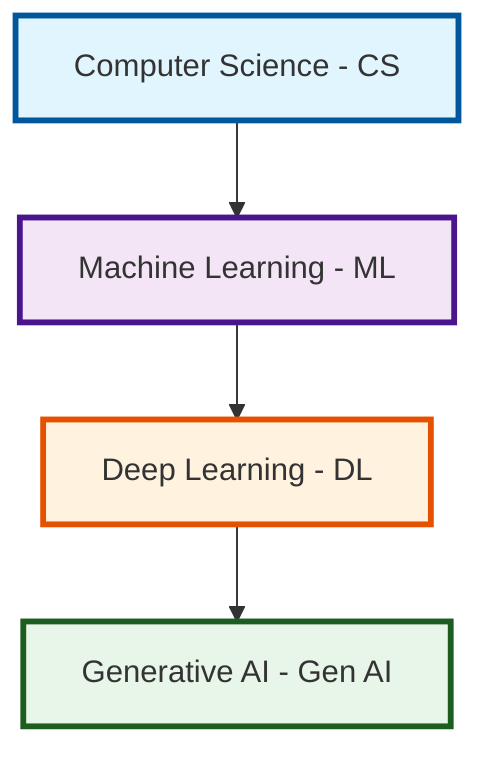

### Visual Representation - The AI Layers:

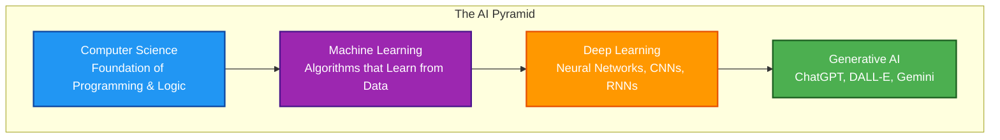

---

## Computer Science (CS)

**Computer Science** is the foundation of AI. This is the base layer where everything starts.

### What is Computer Science?

Computer Science is a field that studies computers and computational systems:
- **Programming**: Writing code (Python, JavaScript, etc.)
- **Algorithms**: Step-by-step problem-solving methods
- **Data Structures**: Organizing data efficiently
- **Logic Building**: Logical thinking and problem solving

### Why CS is Important for AI?

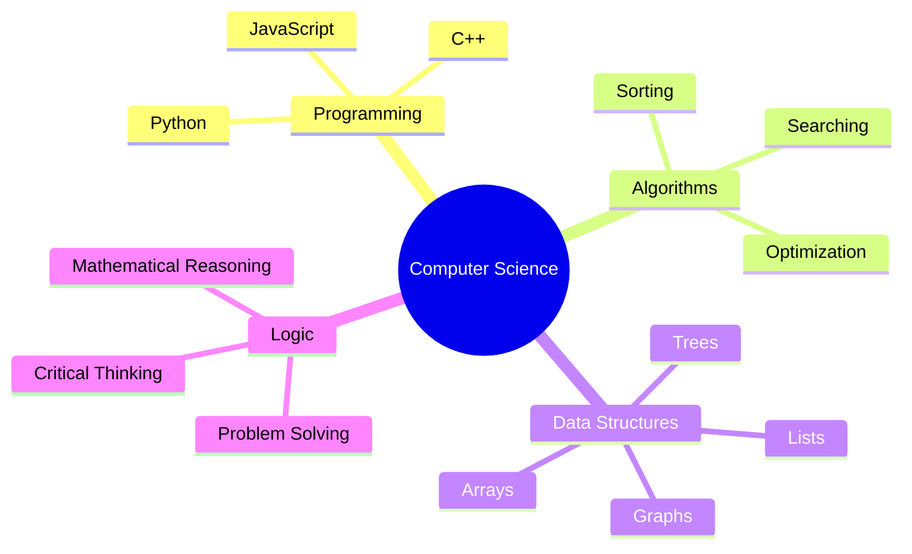

### Example: Simple Programming Logic

```python
# Simple AI decision-making logic
temperature = 35

if temperature > 30:
    print("It's hot! Turn on AC")
elif temperature > 20:
    print("Weather is pleasant")
else:
    print("It's cold! Wear warm clothes")
```

**This basic programming logic is the foundation of AI!**

---

## Machine Learning (ML)

**Machine Learning** is a subset of AI where computers **learn from data** without being explicitly programmed.

### Traditional Programming vs Machine Learning

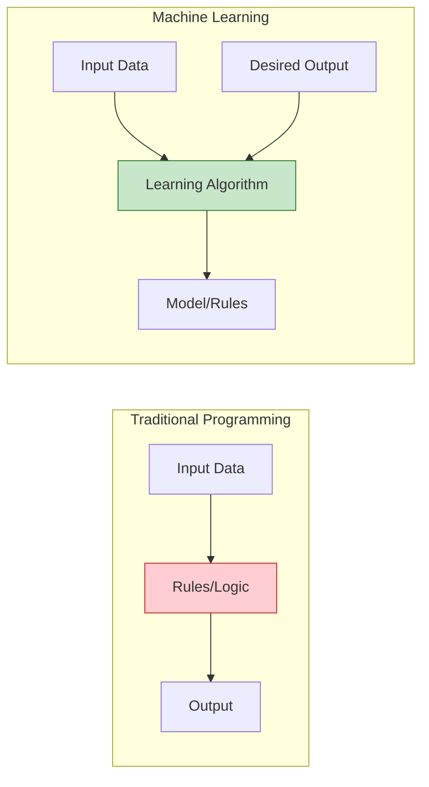

### How Machine Learning Works?

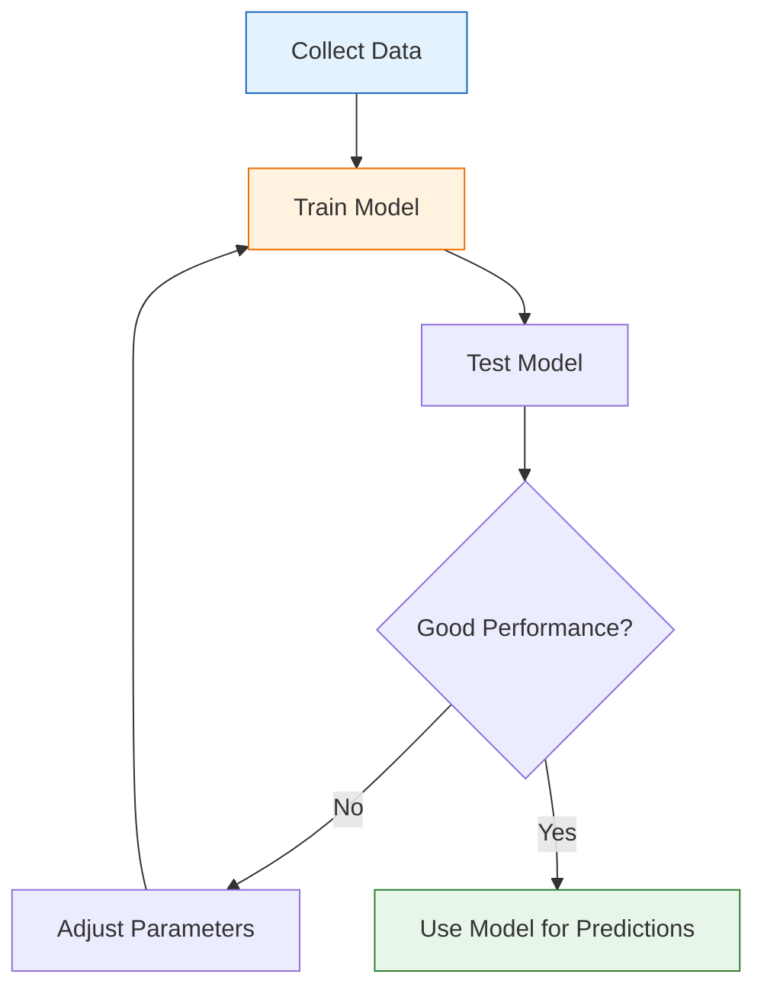

### Types of Machine Learning:

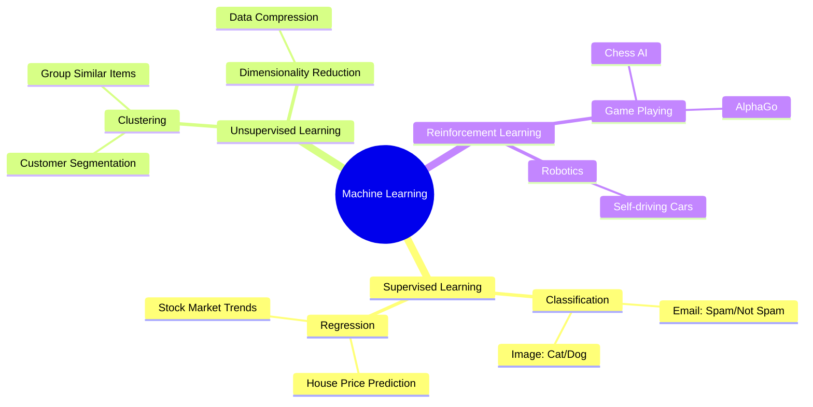

### Real-World Example: Email Spam Filter

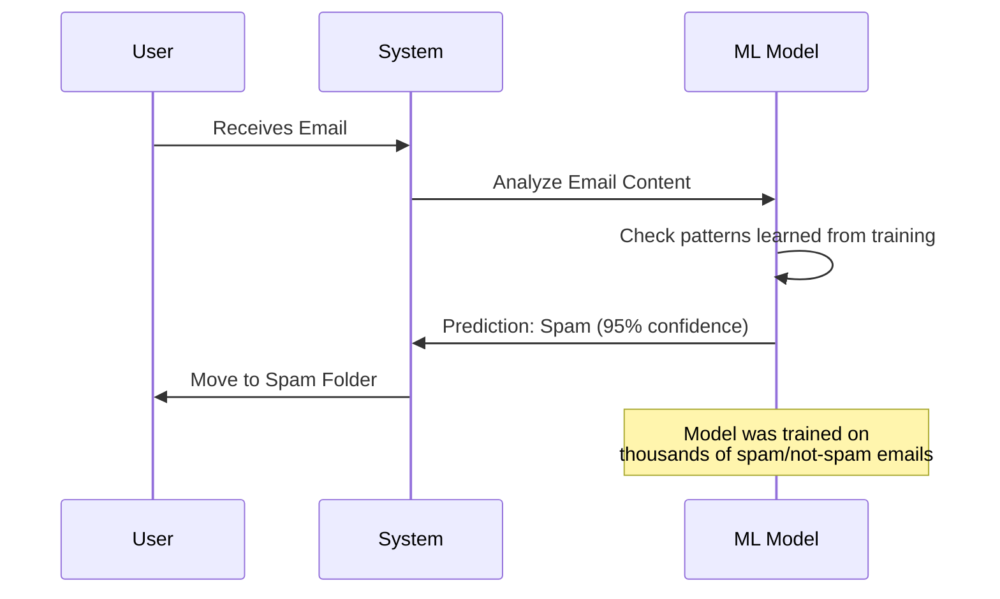

### Example Code (Conceptual):

```python
# Machine Learning Example - Email Spam Detection
from sklearn.naive_bayes import MultinomialNB

# Training data (simplified)
emails = [
    "Win free money now!!!",  # Spam
    "Meeting at 3pm tomorrow",  # Not Spam
    "Claim your prize!!!",  # Spam
    "Project deadline next week"  # Not Spam
]

labels = [1, 0, 1, 0]  # 1=Spam, 0=Not Spam

# Train the model
model = MultinomialNB()
model.fit(emails_features, labels)

# Predict new email
new_email = "Congratulations! You won lottery!!!"
prediction = model.predict([new_email_features])
# Output: 1 (Spam)
```

---

## Deep Learning (DL)

**Deep Learning** is an advanced subset of Machine Learning that uses **artificial neural networks** inspired by the human brain.

### What is Deep Learning?

Deep Learning is a technique that works like the human brain using **artificial neural networks**.

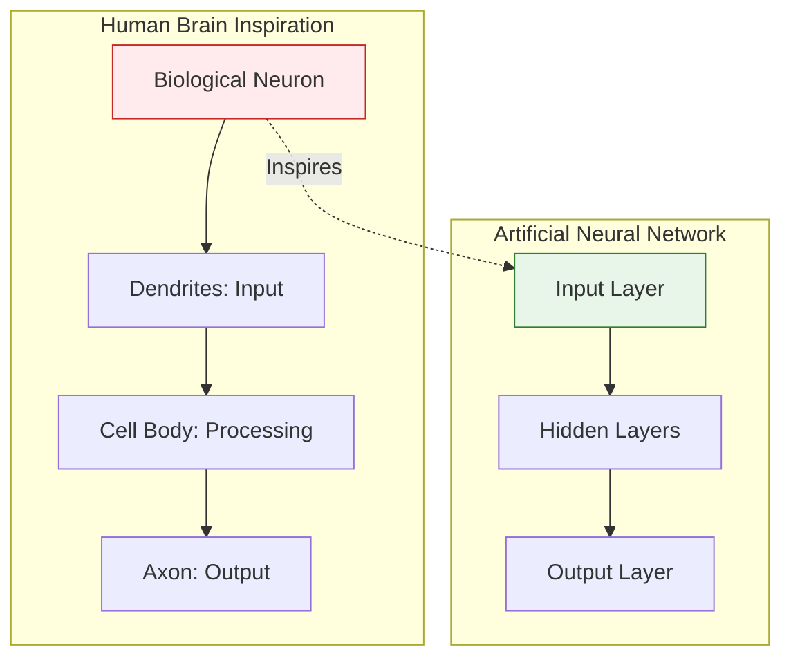

### Neural Network Structure:

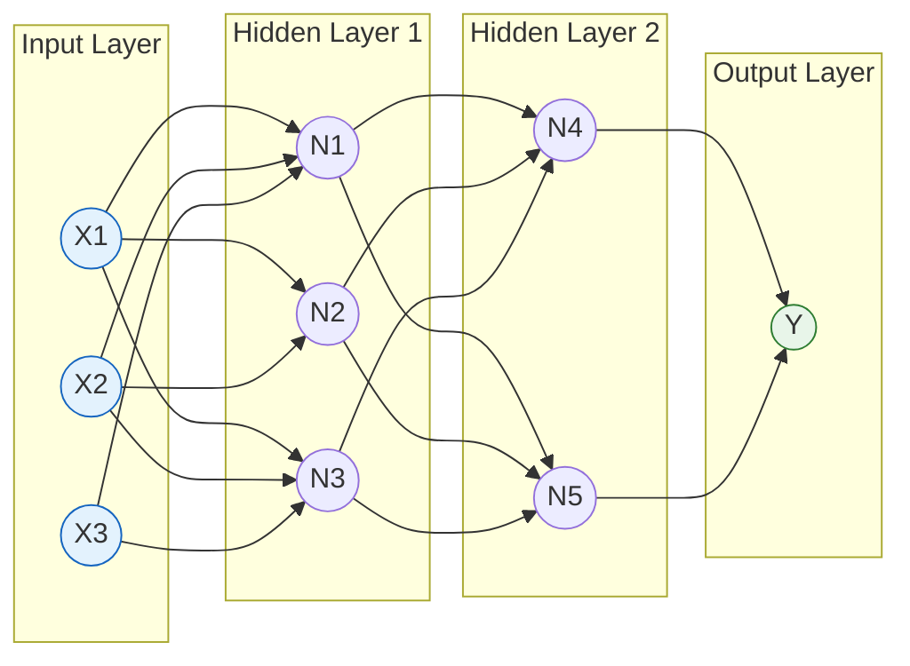

### Deep Learning vs Machine Learning:

| Feature | Machine Learning | Deep Learning |
|---------|-----------------|---------------|
| **Data Required** | Smaller datasets | Large datasets |
| **Feature Engineering** | Manual feature selection | Automatic feature learning |
| **Training Time** | Faster | Slower (requires more computation) |
| **Hardware** | Regular CPU sufficient | GPU/TPU recommended |
| **Examples** | Linear Regression, Decision Trees | Neural Networks, CNNs, RNNs |

### Deep Learning Applications:

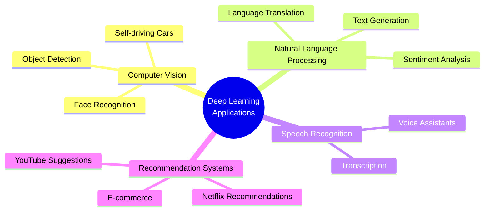

### Example: Image Recognition

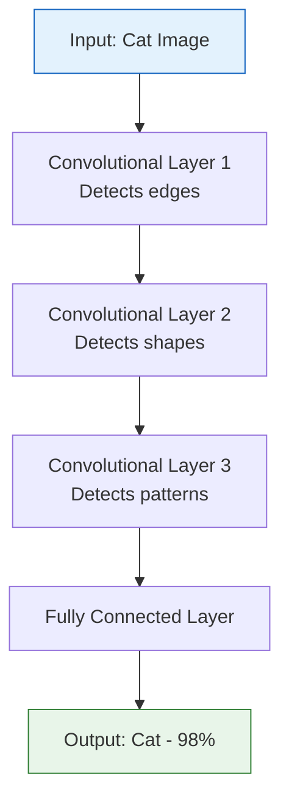

---

## Generative AI (Gen AI)

**Generative AI** is the most advanced form of AI that can **create new, original content**.

### What is Generative AI?

Generative AI is a type of AI that **generates new, original content**:
- Text (ChatGPT, Gemini)
- Images (DALL-E, Midjourney)
- Code (GitHub Copilot)
- Music (AIVA)
- Videos (Runway ML)

### How Generative AI Works:

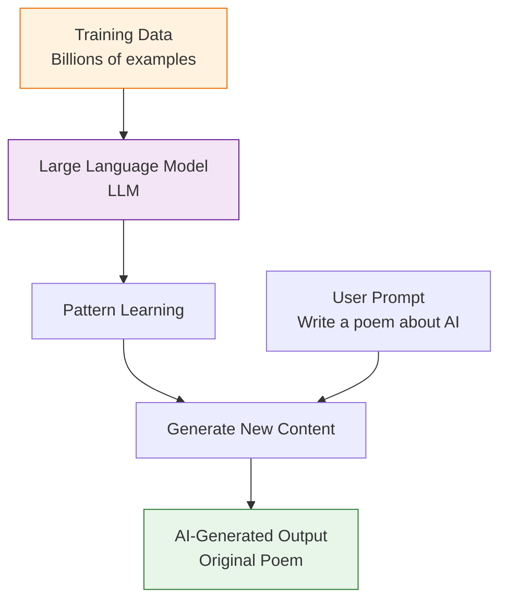

### Types of Generative AI:

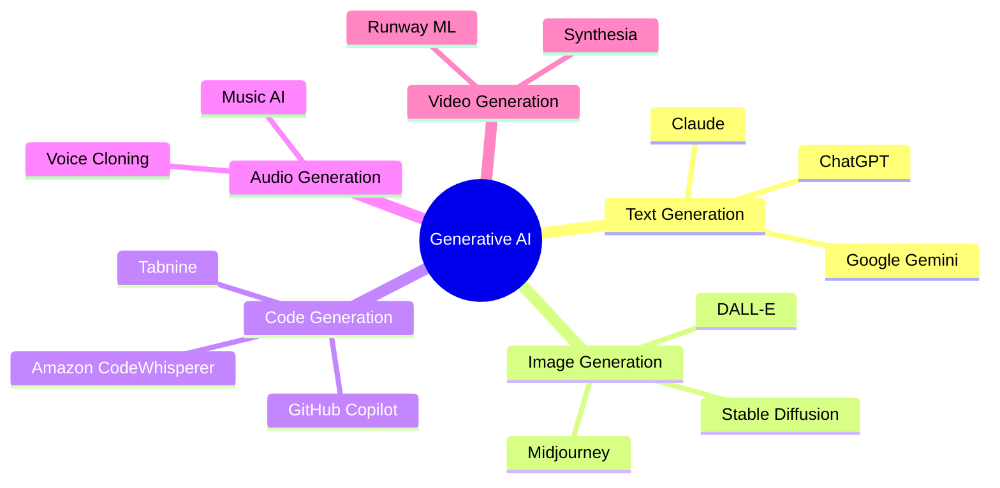

### Traditional AI vs Generative AI:

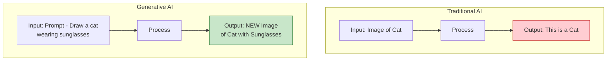

### Real Example: ChatGPT Workflow

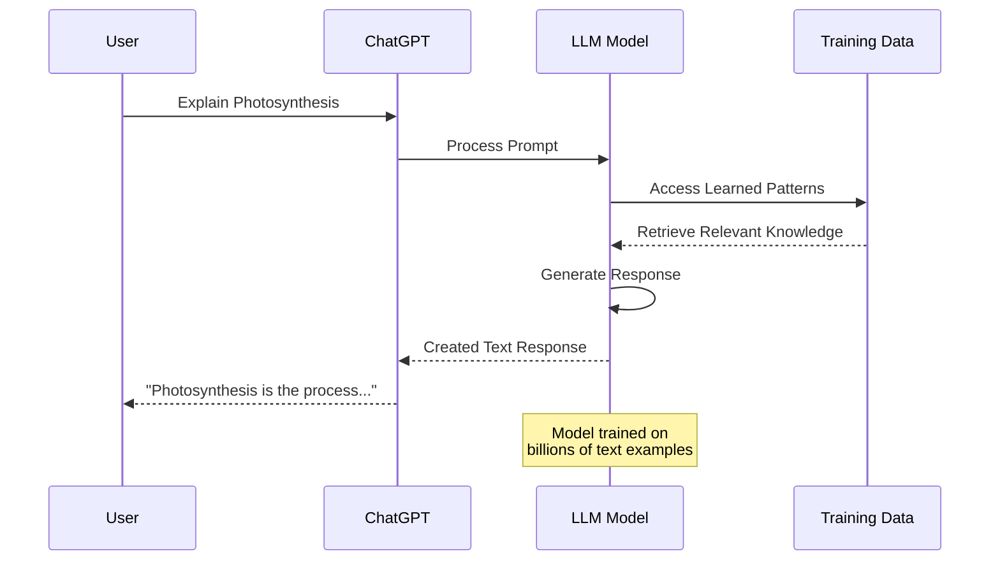

---

## AI Evolution Timeline

How has AI developed over the years? Let's see the journey:

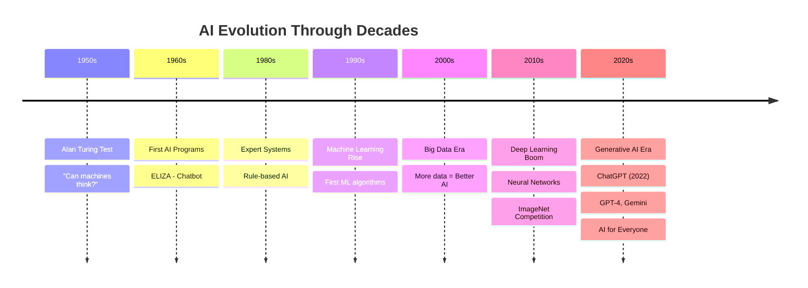

### Major Milestones:

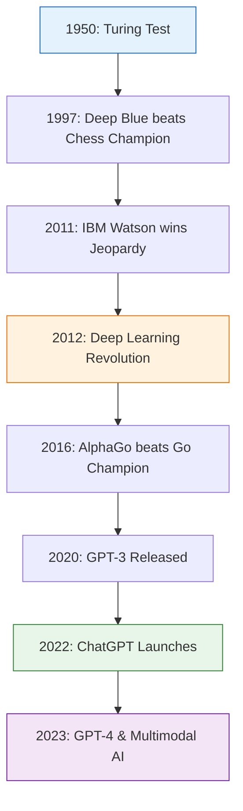

---

## Real-World Applications

### AI in Daily Life:

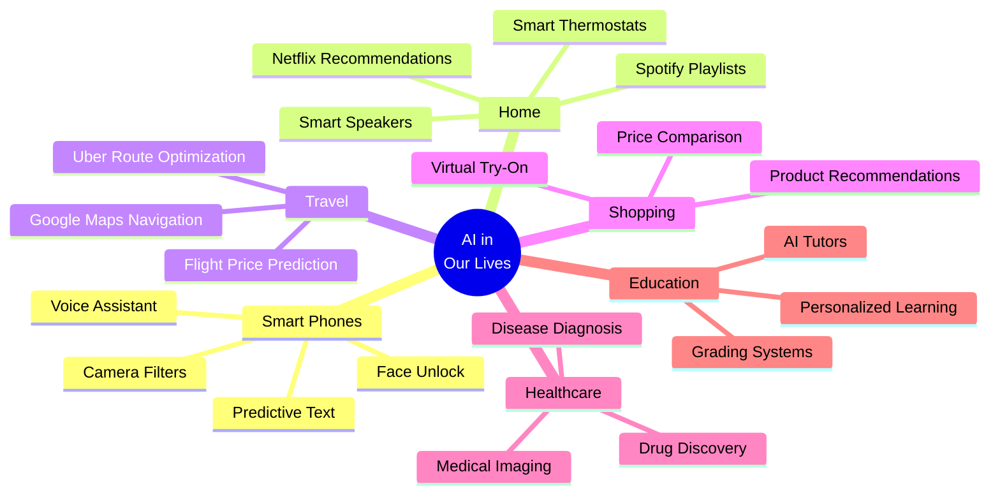

### Industry-wise AI Applications:

| Industry | AI Application | Example |
|----------|----------------|---------|
| **Healthcare** | Disease Detection | AI analyzing X-rays to detect cancer |
| **Finance** | Fraud Detection | Banks using AI to detect unusual transactions |
| **E-commerce** | Product Recommendations | Amazon suggesting products |
| **Transportation** | Self-Driving Cars | Tesla Autopilot |
| **Education** | Personalized Learning | Duolingo adapting to your level |
| **Entertainment** | Content Creation | Netflix creating thumbnails |
| **Agriculture** | Crop Monitoring | Drones detecting plant diseases |

---

## Summary: Complete PATH Diagram

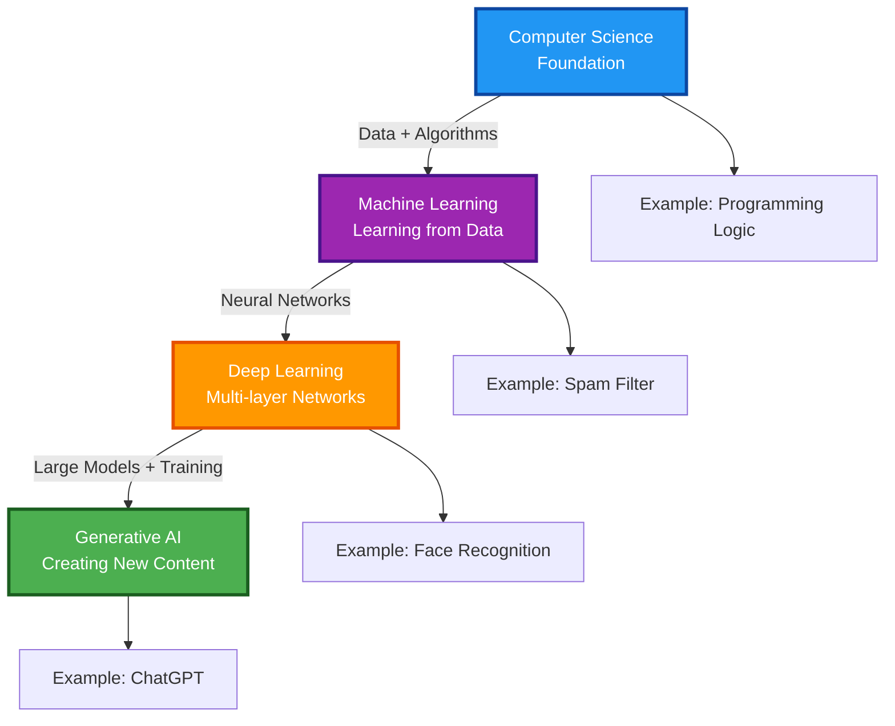

---

## Practice Questions

### Multiple Choice Questions:

1. **What is the foundation of AI?**
   - a) Deep Learning
   - b) Computer Science
   - c) Generative AI
   - d) Machine Learning

   **Answer: b) Computer Science**

2. **Which AI type learns from data without being explicitly programmed?**
   - a) Traditional Programming
   - b) Machine Learning
   - c) Computer Science
   - d) None of the above

   **Answer: b) Machine Learning**

3. **What is ChatGPT an example of?**
   - a) Machine Learning
   - b) Deep Learning
   - c) Generative AI
   - d) Computer Science

   **Answer: c) Generative AI**

### Short Answer Questions:

1. **Explain the difference between Traditional Programming and Machine Learning.**
2. **List 3 real-world applications of AI you use daily.**
3. **What is the role of Neural Networks in Deep Learning?**

### Practical Exercise:

**Think of 5 AI applications you interact with daily and categorize them:**
- ML Application
- DL Application
- Generative AI Application

---

## Key Takeaways

1. **AI's foundation is Computer Science**
2. **Machine Learning learns from data**
3. **Deep Learning uses neural networks**
4. **Generative AI creates new content**
5. **AI is an important part of our daily life**

---

## Next Class Preview

In the next class, we will learn about:
- **Large Language Models (LLMs)**
- **Tokens and Context Windows**
- **How ChatGPT Actually Works**
- **Prompt Engineering Basics**

---

**Happy Learning!**

*Stay curious, keep exploring AI!*
