# Week 1 - Class 2: Understanding LLMs, Tokens & Context Windows

## Table of Contents
1. [What are Large Language Models (LLMs)?](#what-are-large-language-models-llms)
2. [How LLMs Work](#how-llms-work)
3. [Understanding Tokens](#understanding-tokens)
4. [Context Windows Explained](#context-windows-explained)
5. [Parameters in AI Models](#parameters-in-ai-models)
6. [Popular LLMs Comparison](#popular-llms-comparison)
7. [Practical Examples](#practical-examples)
8. [Limitations of LLMs](#limitations-of-llms)
9. [Practice Questions](#practice-questions)

---

## What are Large Language Models (LLMs)?

**Large Language Models (LLMs)** wo AI models hain jo text ko samajh sakte hain aur generate kar sakte hain. Ye models **billions of parameters** ke saath train kiye jaate hain.

### Simple Definition:

> LLMs are AI models trained on massive amounts of text data that can understand, generate, and work with human language.

### Real Examples:
- **ChatGPT** (OpenAI)
- **Google Gemini** (Google)
- **Claude** (Anthropic)
- **Llama** (Meta)

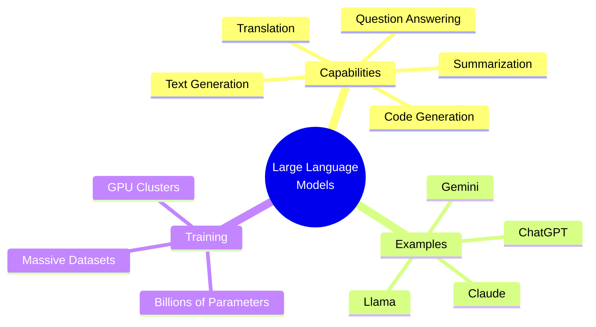

---

## How LLMs Work

LLMs kaam kaise karte hain? Let's break it down step by step.

### Training Process:

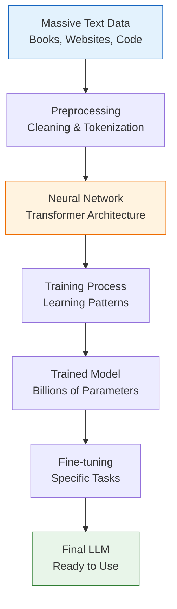

### How LLMs Predict Next Word:

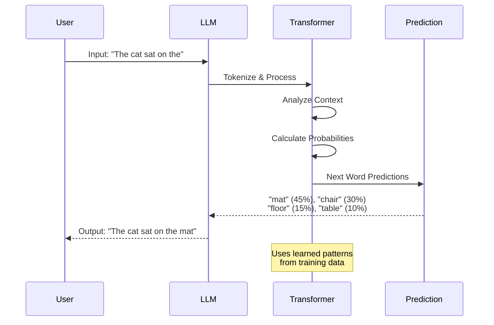

### Transformer Architecture (Simplified):

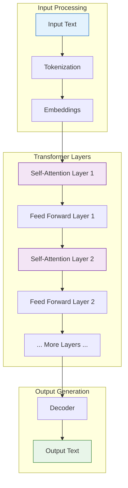

---

## Understanding Tokens

**Tokens** wo basic units hain jisme text ko divide kiya jaata hai. Tokens words, sub-words, ya characters ho sakte hain.

### What is a Token?

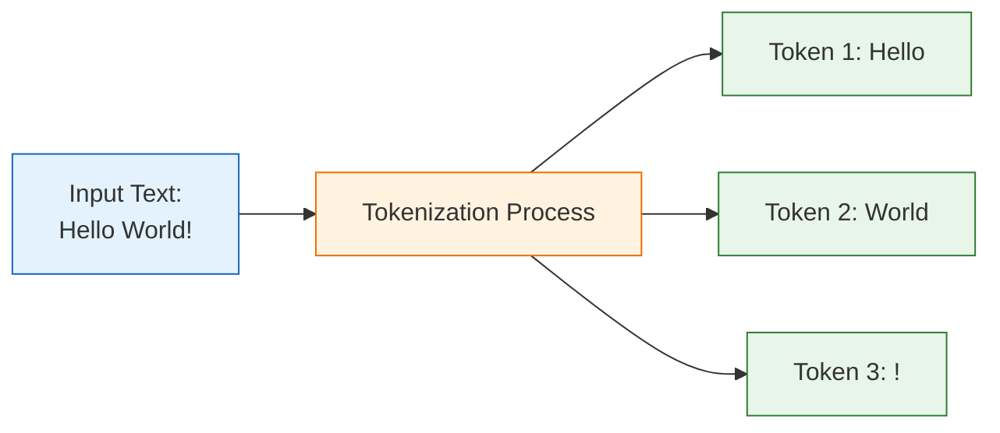

### Tokenization Examples:

| Input Text | Tokens | Token Count |
|------------|--------|-------------|
| "Hello" | ["Hello"] | 1 |
| "Hello World" | ["Hello", " World"] | 2 |
| "ChatGPT" | ["Chat", "GPT"] | 2 |
| "artificial intelligence" | ["art", "ificial", " intelligence"] | 3 |
| "AI है बहुत अच्छा" | ["AI", " है", " बहुत", " अच्छा"] | 4 |

### How Tokenization Works:

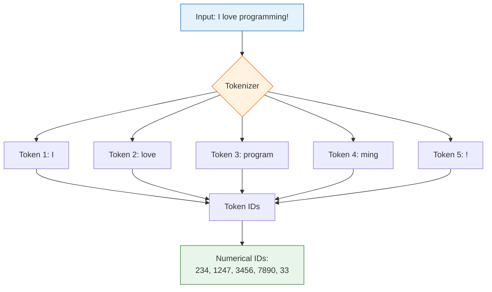

### Why Tokens Matter?

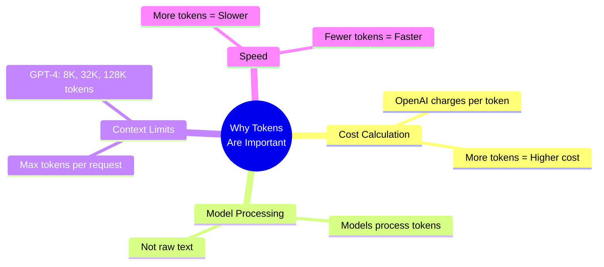

### Token Count Examples (Real-World):

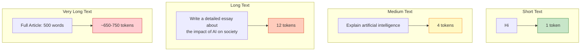

### Practical Token Calculator:

```
Average Rule: 1 token ≈ 4 characters (English)
              1 token ≈ 0.75 words (English)

Examples:
- 100 words ≈ 133 tokens
- 1000 characters ≈ 250 tokens
- 1 page (500 words) ≈ 667 tokens
```

---

## Context Windows Explained

**Context Window** wo maximum amount hai information (tokens) jitna ek LLM ek time mein process kar sakta hai.

### What is Context Window?

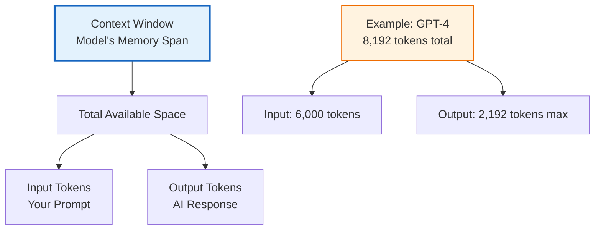

### Context Window Analogy:

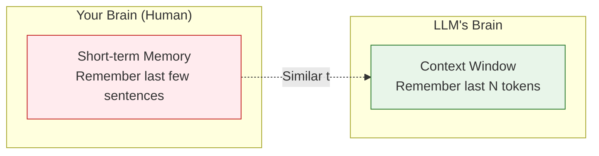

### How Context Window Works:

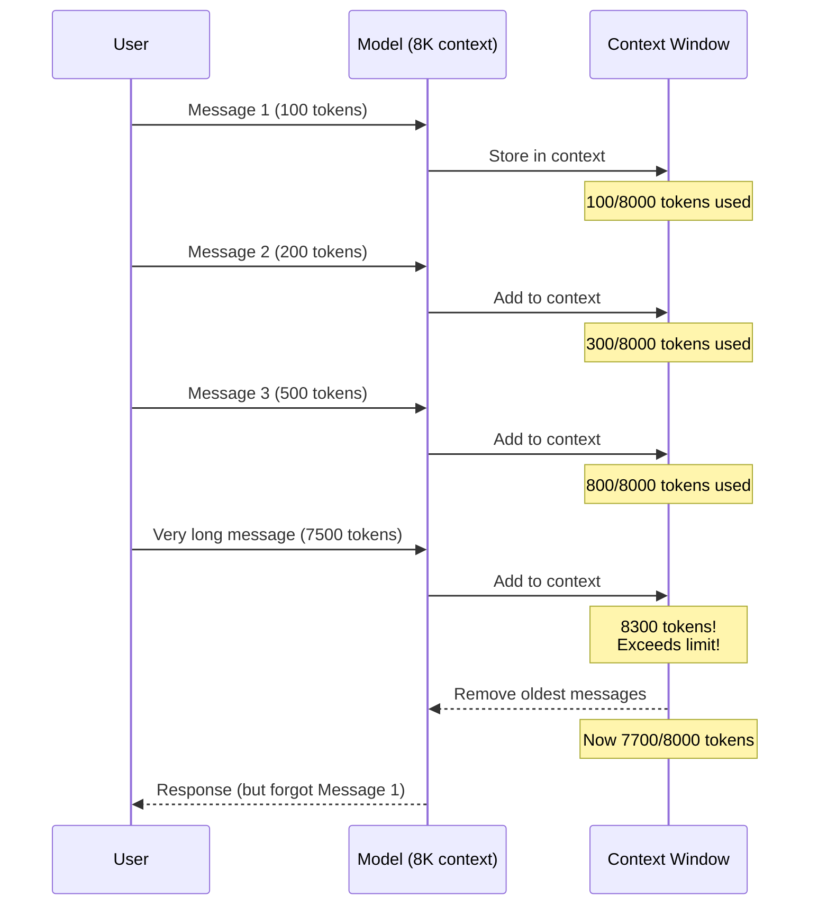

### Context Window Sizes Comparison:

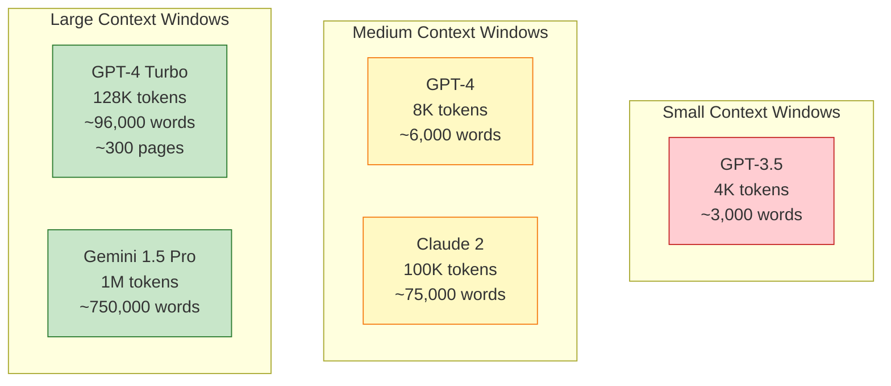

### What Happens When Context is Full?

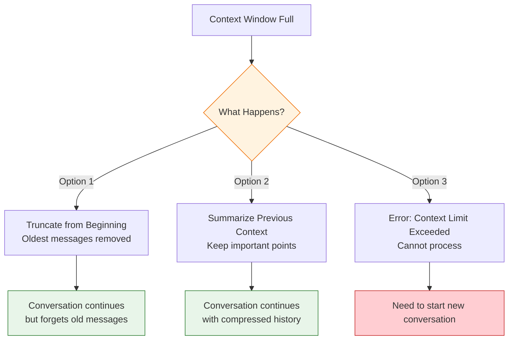

### Practical Example:

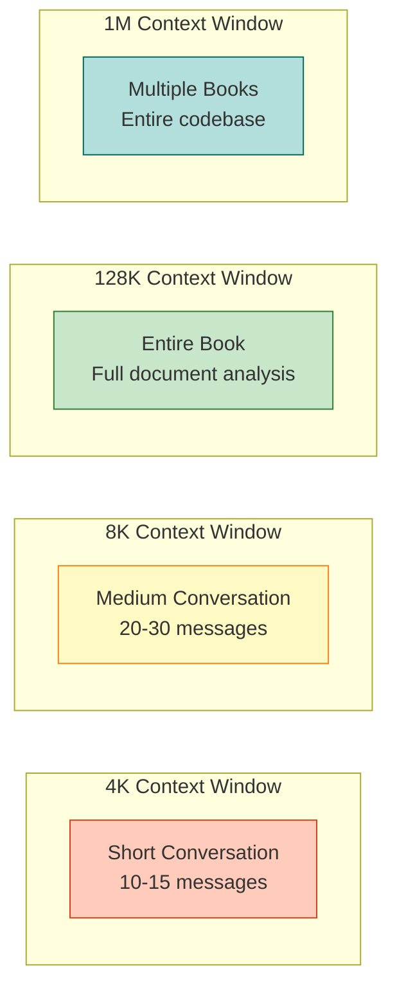

---

## Parameters in AI Models

**Parameters** wo internal variables hain jo model training ke dauran learn karta hai.

### What are Parameters?

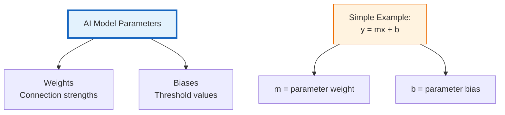

### Parameter Count Comparison:

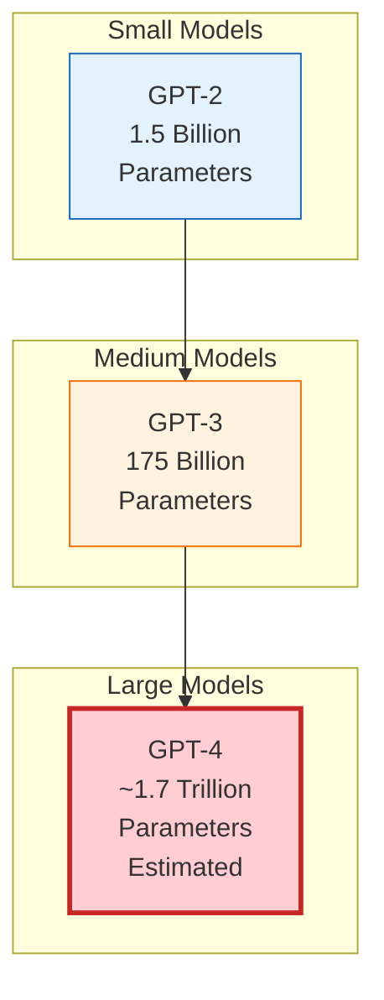

### Why More Parameters?

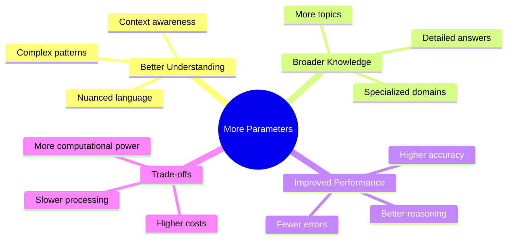

### Parameters vs Performance:

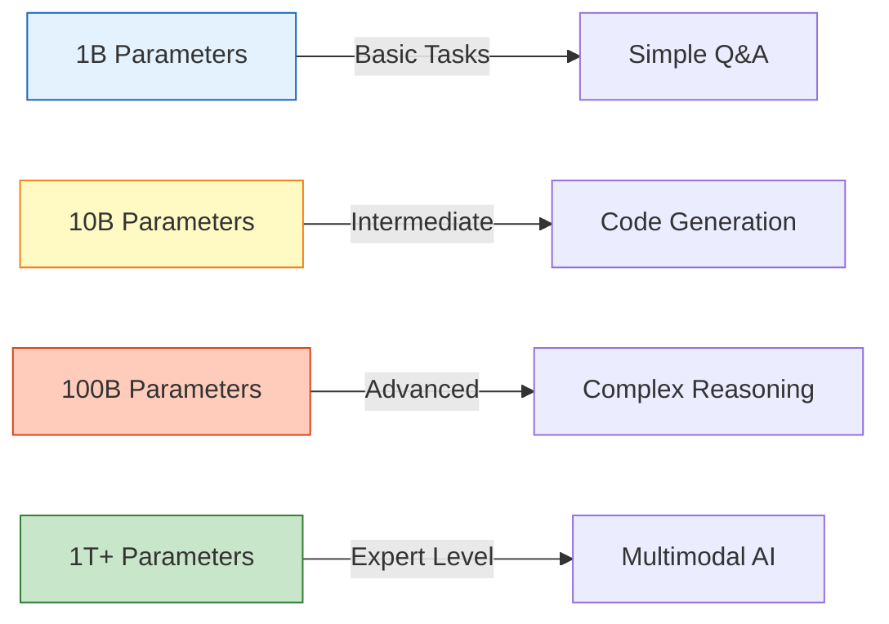

---

## Popular LLMs Comparison

### Comprehensive Comparison Table:

| Model | Company | Parameters | Context Window | Special Features |
|-------|---------|------------|----------------|------------------|
| **GPT-4** | OpenAI | ~1.7T | 8K / 32K / 128K | Multimodal, highest accuracy |
| **GPT-3.5 Turbo** | OpenAI | 175B | 4K / 16K | Fast, cost-effective |
| **Gemini Pro** | Google | Unknown | 32K | Multimodal, Google integrated |
| **Gemini 1.5 Pro** | Google | Unknown | 1M tokens | Largest context window |
| **Claude 3** | Anthropic | Unknown | 200K | Long document analysis |
| **Llama 2** | Meta | 70B | 4K | Open-source |
| **Mistral** | Mistral AI | 7B | 8K | Efficient, open-source |

### Visual Comparison:

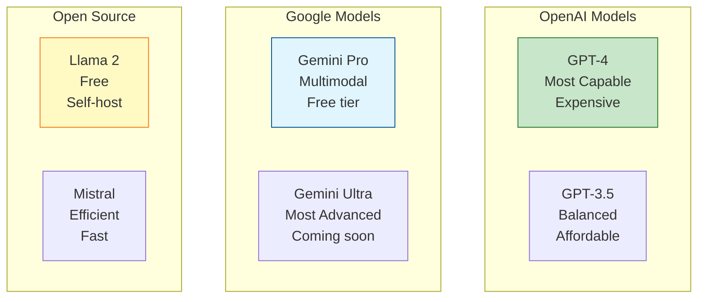

### Use Case Recommendations:

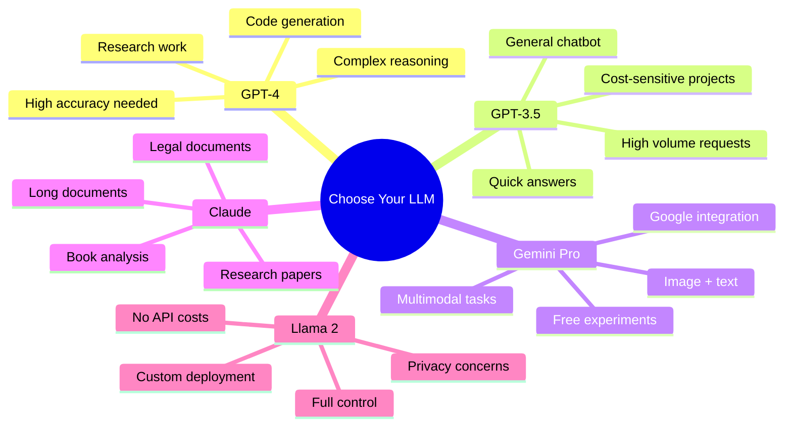

---

## Practical Examples

### Example 1: Token Calculation

```mermaid
sequenceDiagram
    participant U as User
    participant T as Tokenizer
    participant C as Counter

    U->>T: "Explain machine learning in simple terms"
    T->>T: Split into tokens
    T->>C: ["Explain", " machine", " learning",<br/>" in", " simple", " terms"]
    C->>C: Count = 6 tokens
    C-->>U: Total: 6 input tokens

    Note over T,C: Plus AI response tokens<br/>Total cost = input + output tokens
```

### Example 2: Context Window Overflow

**Scenario:** ChatGPT with 4K context window

```mermaid
graph TD
    A[User starts conversation] --> B[Message 1: 200 tokens]
    B --> C[Message 2: 300 tokens]
    C --> D[Message 3: 400 tokens]
    D --> E[Total: 900 tokens ✓]

    E --> F[Message 4: 3500 tokens]
    F --> G{Total: 4400 tokens<br/>Exceeds 4K limit!}

    G -->|System Action| H[Remove Message 1<br/>200 tokens]
    H --> I[New total: 4200 tokens<br/>Still over limit]
    I --> J[Remove Message 2<br/>300 tokens]
    J --> K[Final: 3900 tokens ✓]
    K --> L[AI forgets Messages 1 & 2]

    style G fill:#ffcdd2,stroke:#c62828
    style K fill:#c8e6c9,stroke:#2e7d32
    style L fill:#fff3e0,stroke:#ef6c00
```

### Example 3: Model Selection Flow

```mermaid
graph TD
    A{What's your task?} --> B[Simple Q&A]
    A --> C[Code Generation]
    A --> D[Long Document Analysis]
    A --> E[Image + Text]

    B --> F[Use GPT-3.5<br/>Fast & Cheap]
    C --> G[Use GPT-4<br/>High Accuracy]
    D --> H[Use Claude<br/>200K context]
    E --> I[Use Gemini Pro<br/>Multimodal]

    style A fill:#e3f2fd,stroke:#1565c0
    style F fill:#c8e6c9,stroke:#2e7d32
    style G fill:#c8e6c9,stroke:#2e7d32
    style H fill:#c8e6c9,stroke:#2e7d32
    style I fill:#c8e6c9,stroke:#2e7d32
```

---

## Limitations of LLMs

LLMs powerful hain, but unki limitations bhi hain:

```mermaid
mindmap
  root((LLM Limitations))
    Knowledge Cutoff
      Trained on old data
      No real-time information
      Example: GPT-4 cutoff April 2023
    Context Limits
      Forgets old messages
      Cannot process very long docs
      Some models: only 4K tokens
    Hallucinations
      Makes up facts
      Confident but wrong
      Needs fact-checking
    Bias
      Training data bias
      Cultural bias
      May need filtering
    No Real Understanding
      Pattern matching
      No true comprehension
      Cannot reason like humans
    Cost
      API costs per token
      Expensive for large scale
      Need budget planning
```

### Common Issues:

```mermaid
graph TD
    A[LLM Limitations] --> B[Hallucination Example]
    A --> C[Context Forgetting]
    A --> D[Outdated Information]

    B --> B1["User: Who won 2024 World Cup?<br/>AI: Makes up answer<br/>Actually doesn't know"]

    C --> C1["Long conversation<br/>AI forgets earlier messages<br/>Repeats questions"]

    D --> D1["User: Latest iPhone price?<br/>AI: Gives 2023 data<br/>Prices changed"]

    style B1 fill:#ffcdd2,stroke:#c62828
    style C1 fill:#fff3e0,stroke:#ef6c00
    style D1 fill:#ffe0b2,stroke:#e65100
```

---

## Summary Diagram: Complete Overview

```mermaid
graph TB
    A[Large Language Models]

    A --> B[Key Concepts]
    B --> B1[Tokens<br/>Text units<br/>4 chars ≈ 1 token]
    B --> B2[Context Window<br/>Memory span<br/>4K to 1M tokens]
    B --> B3[Parameters<br/>Model size<br/>1B to 1T+]

    A --> C[Popular Models]
    C --> C1[GPT-4<br/>Most capable]
    C --> C2[Gemini<br/>Largest context]
    C --> C3[Claude<br/>Long docs]

    A --> D[Applications]
    D --> D1[Chat]
    D --> D2[Code]
    D --> D3[Analysis]

    A --> E[Limitations]
    E --> E1[Hallucinations]
    E --> E2[Context limits]
    E --> E3[Costs]

    style A fill:#e3f2fd,stroke:#1565c0,stroke-width:3px
    style B fill:#f3e5f5,stroke:#6a1b9a
    style C fill:#fff3e0,stroke:#ef6c00
    style D fill:#c8e6c9,stroke:#2e7d32
    style E fill:#ffcdd2,stroke:#c62828
```

---

## Practice Questions

### Multiple Choice:

1. **What is a token in LLMs?**
   - a) A password
   - b) A basic unit of text
   - c) A type of model
   - d) A programming language

   **Answer: b) A basic unit of text**

2. **What is a context window?**
   - a) A browser window
   - b) Maximum tokens an LLM can process at once
   - c) A chat window
   - d) A coding editor

   **Answer: b) Maximum tokens an LLM can process at once**

3. **Which model has the largest context window?**
   - a) GPT-4 (8K)
   - b) GPT-3.5 (4K)
   - c) Gemini 1.5 Pro (1M)
   - d) Claude (100K)

   **Answer: c) Gemini 1.5 Pro (1M)**

### Practical Exercises:

1. **Estimate tokens:**
   - Input: "Artificial Intelligence is transforming the world"
   - Approximately how many tokens? (Use rule: 1 token ≈ 0.75 words)

2. **Context limit scenario:**
   - You have GPT-3.5 (4K context)
   - Your conversation used 3,800 tokens
   - Can you send a 500-token message?
   - What will happen?

3. **Model selection:**
   - Task: Analyze a 100-page research paper
   - Which model would you choose and why?

---

## Key Takeaways

```mermaid
mindmap
  root((Week 1 Complete<br/>Summary))
    Class 1
      AI PATH
      CS → ML → DL → Gen AI
      Applications
    Class 2
      LLMs
      Tokens
      Context Windows
      Parameters
    Next Steps
      Learn Prompt Engineering
      Practice with ChatGPT
      Understand AI ethics
```

---

## Next Week Preview

In Week 2, we will learn:
- **Prompt Engineering Fundamentals**
- **How to write effective prompts**
- **Zero-shot, Few-shot, Chain-of-thought prompting**
- **Practical prompt templates**
- **Best practices and tips**

---

**Congratulations! You've completed Week 1!**

*You now understand:*
- ✅ AI foundations (CS → ML → DL → Gen AI)
- ✅ How LLMs work
- ✅ Tokens and their importance
- ✅ Context windows and limitations
- ✅ Different AI models and when to use them

**Keep learning, keep growing!**
