# Week 2 - Class 1: Introduction to Prompt Engineering

## Table of Contents
1. [What is Prompt Engineering?](#what-is-prompt-engineering)
2. [Why Prompt Engineering Matters](#why-prompt-engineering-matters)
3. [Anatomy of a Good Prompt](#anatomy-of-a-good-prompt)
4. [Basic Prompting Techniques](#basic-prompting-techniques)
5. [Zero-Shot Prompting](#zero-shot-prompting)
6. [Few-Shot Prompting](#few-shot-prompting)
7. [Common Mistakes to Avoid](#common-mistakes-to-avoid)
8. [Practical Examples](#practical-examples)
9. [Practice Exercises](#practice-exercises)

---

## What is Prompt Engineering?

**Prompt Engineering** is the art and science of crafting effective instructions (prompts) to get the best responses from AI models like ChatGPT, Gemini, or Claude.

### Simple Definition:
> Prompt Engineering is about asking AI the right questions in the right way to get the best answers.

### Analogy:
Think of AI like a highly skilled assistant:
- **Bad prompt** = Vague question → Unclear answer
- **Good prompt** = Clear, specific question → Accurate, useful answer

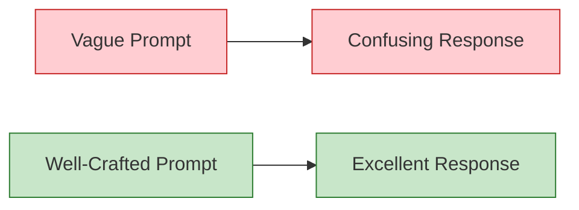

---

## Why Prompt Engineering Matters

Understanding prompt engineering helps you:

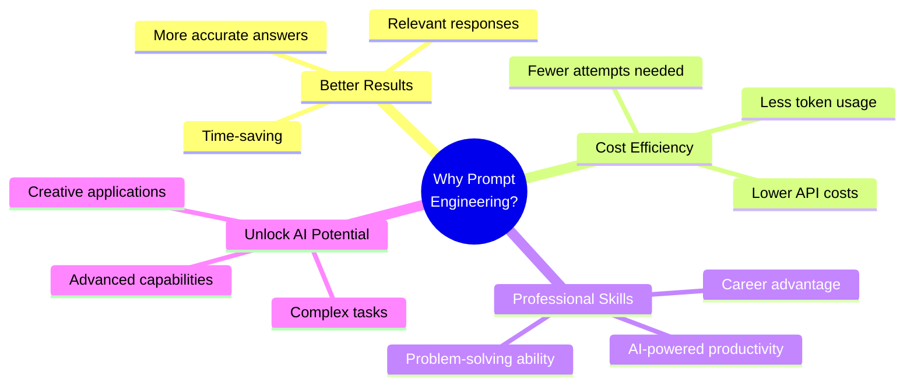

### Real-World Impact:

| Poor Prompt | Good Prompt | Result Difference |
|-------------|-------------|-------------------|
| "Write about AI" | "Write a 200-word introduction to AI for beginners, focusing on real-world applications" | ⭐⭐⭐⭐⭐ vs ⭐⭐ |
| "Code this" | "Write a Python function to calculate factorial with error handling and comments" | Clear vs Vague |
| "Summarize" | "Summarize this article in 3 bullet points focusing on key findings" | Specific vs Generic |

---

## Anatomy of a Good Prompt

A well-crafted prompt has several key components:

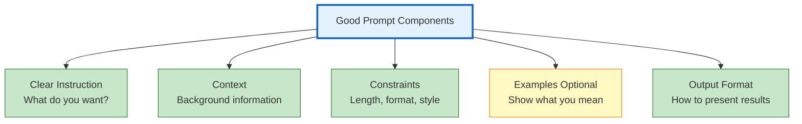

### The PROMPT Formula:

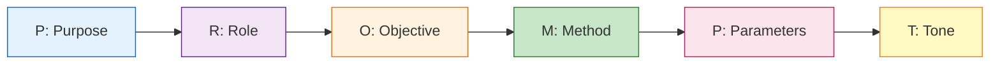

**Example:**
```
Purpose: I need help writing
Role: Act as a professional copywriter
Objective: Create a product description
Method: Use persuasive language with benefits
Parameters: 150 words, include 3 key features
Tone: Friendly and enthusiastic
```

---

## Basic Prompting Techniques

### 1. **Be Specific and Clear**

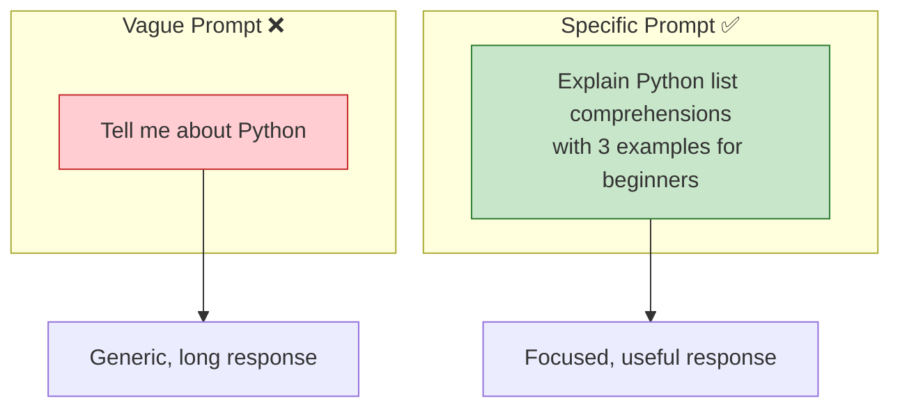

**Examples:**

❌ **Vague:** "Write about climate change"

✅ **Specific:** "Write a 300-word essay about the impact of climate change on coastal cities, include 2 real examples"

---

### 2. **Provide Context**

Context helps AI understand your situation and needs better.

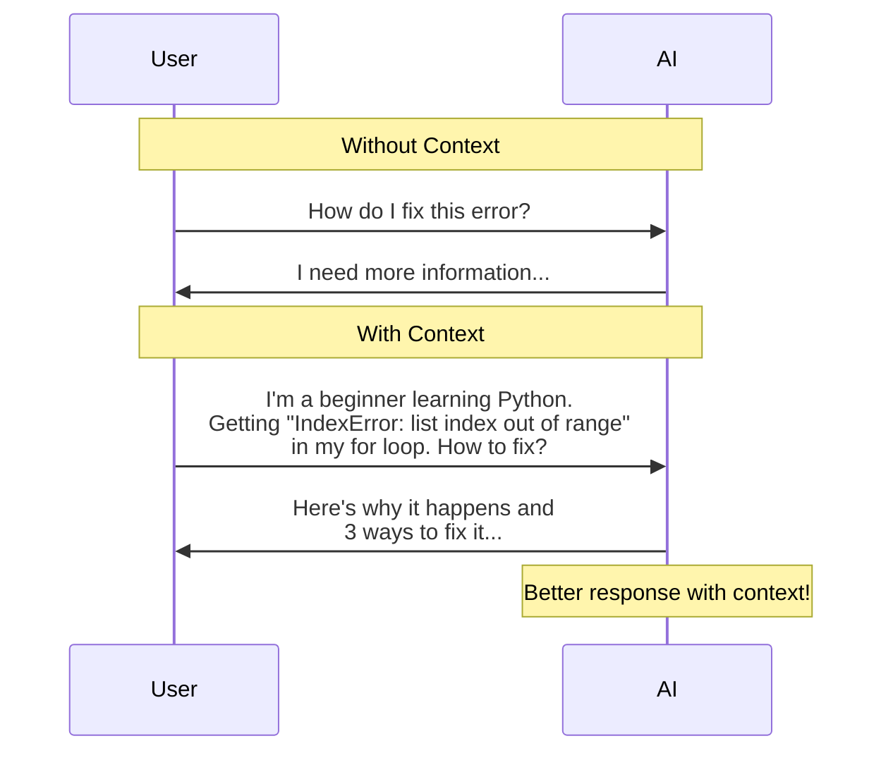

---

### 3. **Specify Format and Length**

Tell AI exactly how you want the output:

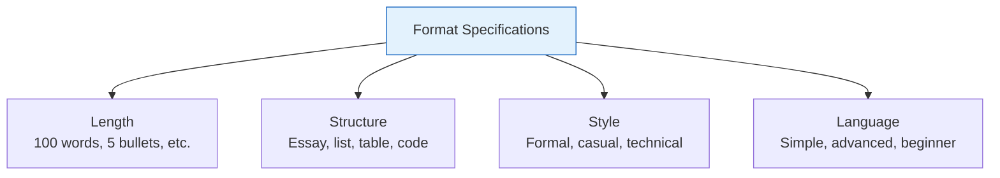

**Example:**

```
Prompt: Explain machine learning
- Format: 5 bullet points
- Length: Each point max 20 words
- Style: Simple language for beginners
- Include: 1 real-world example
```

---

### 4. **Use Role Assignment**

Ask AI to take on a specific role or persona:

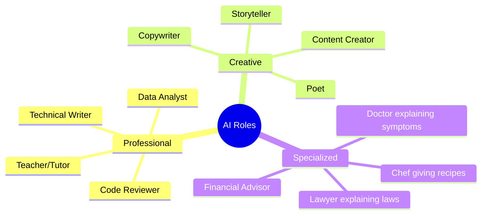

**Example:**

```
Act as a senior Python developer.
Review this code and suggest improvements
focusing on performance and readability.
```

---

## Zero-Shot Prompting

**Zero-Shot** means giving AI a task without providing any examples.

### What is Zero-Shot?

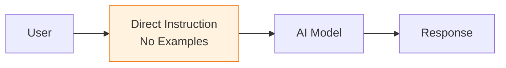

### How it Works:

The AI uses its training to understand and complete the task based solely on the instruction.

### Examples:

**Example 1: Translation**
```
Prompt: Translate "Hello, how are you?" to French.

AI Response: Bonjour, comment allez-vous?
```

**Example 2: Summarization**
```
Prompt: Summarize this article in one sentence:
[Article text...]

AI Response: [One-sentence summary]
```

**Example 3: Classification**
```
Prompt: Classify this email as spam or not spam:
"Congratulations! You've won $1,000,000!"

AI Response: Spam
```

### Zero-Shot Characteristics:

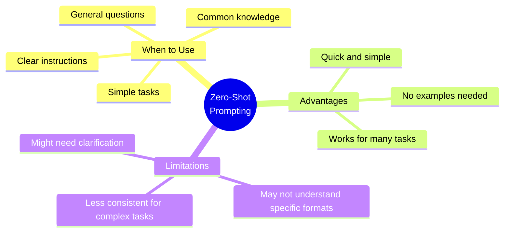

---

## Few-Shot Prompting

**Few-Shot** means providing examples to guide the AI's response format and style.

### What is Few-Shot?

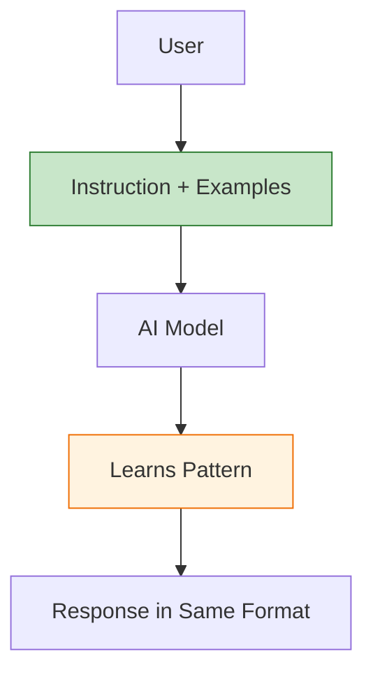

### How it Works:

You show AI examples of input-output pairs, then it follows the same pattern.

### Example 1: Sentiment Analysis

```
Prompt:
Classify the sentiment of these reviews:

Review: "This product is amazing! Highly recommend."
Sentiment: Positive

Review: "Terrible quality, waste of money."
Sentiment: Negative

Review: "It's okay, nothing special."
Sentiment: Neutral

Review: "Best purchase I've made this year!"
Sentiment: ?

AI Response: Positive
```

### Example 2: Data Extraction

```
Prompt:
Extract name and email from these texts:

Text: "Contact John Doe at john@email.com"
Name: John Doe
Email: john@email.com

Text: "Reach out to Sarah Smith, sarah.smith@company.com"
Name: Sarah Smith
Email: sarah.smith@company.com

Text: "Get in touch with Mike Johnson via mike.j@mail.com"
Name: ?
Email: ?

AI Response:
Name: Mike Johnson
Email: mike.j@mail.com
```

### Example 3: Format Conversion

```
Prompt:
Convert these sentences to questions:

Sentence: The sky is blue.
Question: What color is the sky?

Sentence: Python is a programming language.
Question: What is Python?

Sentence: AI helps solve complex problems.
Question: ?

AI Response: What does AI help solve?
```

### Few-Shot vs Zero-Shot:

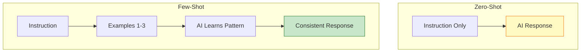

### When to Use Few-Shot:

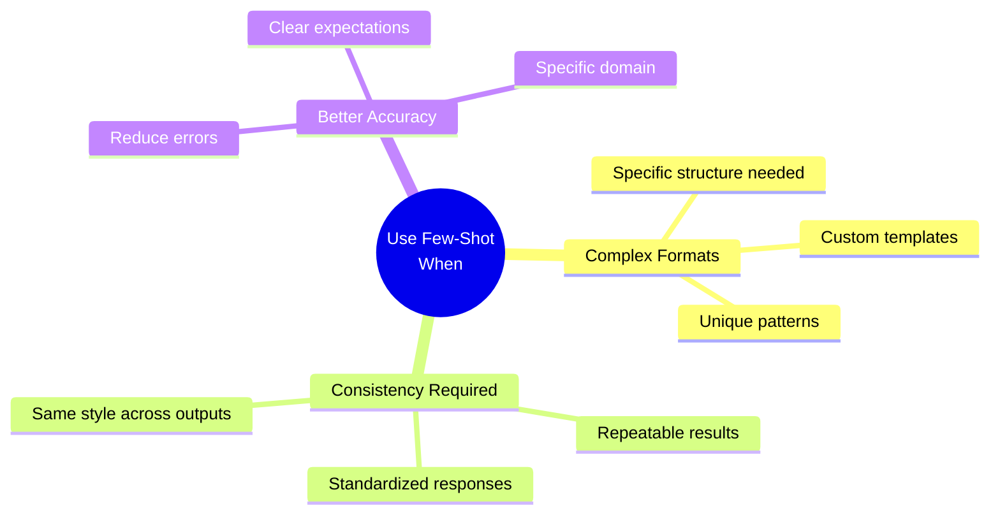

---

## Common Mistakes to Avoid

### 1. **Too Vague**

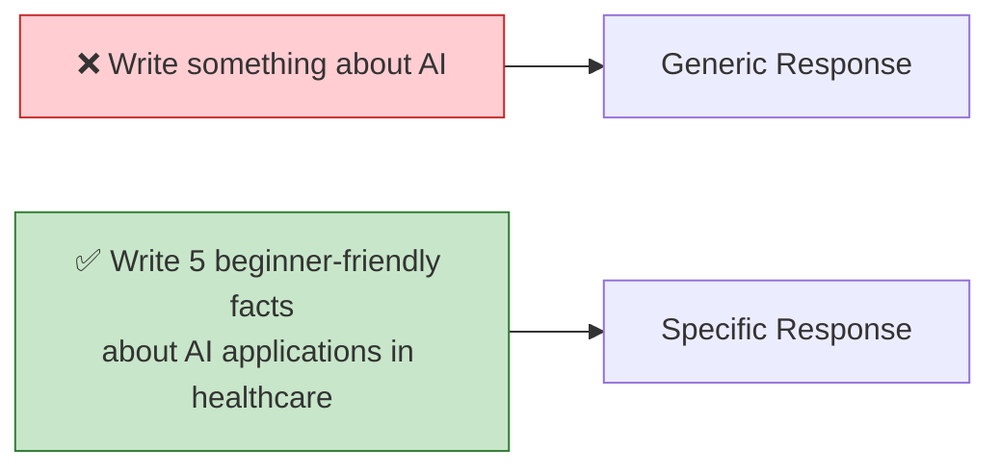

### 2. **No Context**

❌ **Bad:** "How do I fix this?"

✅ **Good:** "I'm building a React app. Getting error 'Cannot read property of undefined' when accessing user.name. How to fix?"

### 3. **Unclear Expectations**

❌ **Bad:** "Explain quantum computing"

✅ **Good:** "Explain quantum computing in 3 paragraphs for someone with basic physics knowledge, avoiding complex math"

### 4. **Too Many Tasks at Once**

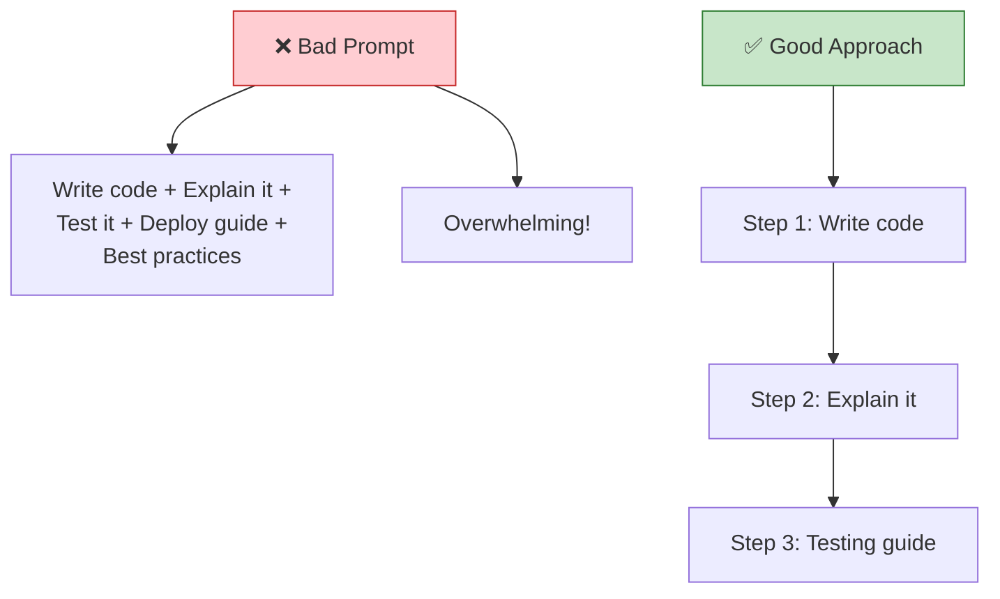

### 5. **Not Specifying Format**

❌ **Bad:** "List programming languages"

✅ **Good:** "List 5 programming languages in a table with columns: Name, Primary Use, Difficulty Level"

---

## Practical Examples

### Example 1: Content Creation

**Bad Prompt:**
```
Write about social media
```

**Good Prompt:**
```
Write a 250-word blog introduction about the impact
of social media on mental health for young adults.

Include:
- 1 surprising statistic
- 2 main points to be discussed
- Engaging opening hook
- Friendly, informative tone
```

---

### Example 2: Code Generation

**Bad Prompt:**
```
Write a function
```

**Good Prompt:**
```
Write a Python function that:
- Takes a list of numbers as input
- Returns the average, rounded to 2 decimal places
- Handles empty lists (return 0)
- Include docstring and type hints
- Add example usage
```

---

### Example 3: Learning Aid

**Bad Prompt:**
```
Teach me JavaScript
```

**Good Prompt:**
```
I'm learning JavaScript as my first programming language.
Explain the concept of "variables" using:
- Simple analogy
- 3 code examples (var, let, const)
- When to use each type
- 1 common beginner mistake to avoid
Keep it under 300 words.
```

---

### Example 4: Data Analysis

**Bad Prompt:**
```
Analyze this data
```

**Good Prompt:**
```
Analyze this sales data and provide:
1. Top 3 best-selling products
2. Month with highest revenue
3. One key trend or pattern you notice
4. One recommendation for improvement

Format: Bullet points, keep each point under 25 words.
```

---

## Prompt Templates

### Template 1: General Task

```
[ROLE]: Act as [specific role/expert]
[TASK]: [What you want to accomplish]
[CONTEXT]: [Background information]
[FORMAT]: [How to present the output]
[CONSTRAINTS]: [Length, style, specific requirements]
[EXAMPLE]: [Optional: show desired format]
```

### Template 2: Learning

```
I'm learning [topic] at [level].
Explain [specific concept] using:
- [Teaching method 1]
- [Teaching method 2]
- [Number] examples
Keep it [length/style].
```

### Template 3: Problem Solving

```
Problem: [Describe the issue]
Context: [Relevant background]
What I've tried: [Previous attempts]
I need: [Specific solution type]
Format: [How to present solution]
```

---

## Practice Exercises

### Exercise 1: Improve These Prompts

**Convert these vague prompts to specific ones:**

1. ❌ "Tell me about Python"
   ✅ Your version: _______________

2. ❌ "Write code"
   ✅ Your version: _______________

3. ❌ "Summarize this"
   ✅ Your version: _______________

### Exercise 2: Zero-Shot Practice

**Write zero-shot prompts for:**

1. Translating a sentence to Spanish
2. Classifying a product review as positive/negative
3. Converting temperature from Celsius to Fahrenheit

### Exercise 3: Few-Shot Practice

**Create a few-shot prompt for:**

Task: Extract city names from sentences

```
Your prompt with examples:
_________________________
_________________________
_________________________
```

### Exercise 4: Role Assignment

**Write prompts where AI acts as:**

1. A fitness coach
2. A code reviewer
3. A creative writer

---

## Key Takeaways

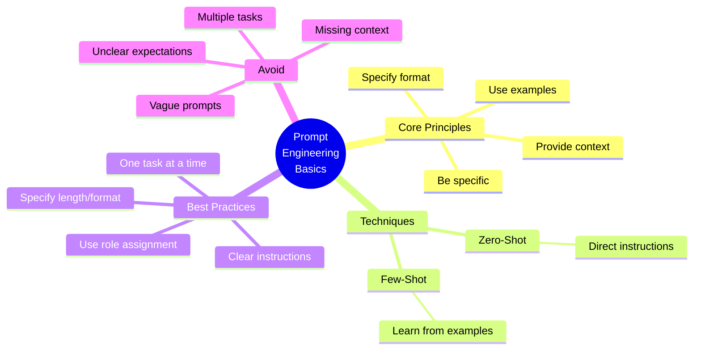

---

## Summary: Before & After

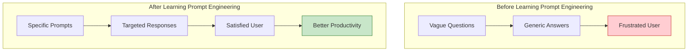

---

## Next Class Preview

In **Class 2**, we will learn:
- **Chain-of-Thought Prompting**
- **Self-Consistency Techniques**
- **Prompt Chaining for Complex Tasks**
- **Advanced Formatting Tricks**
- **Industry-Specific Prompting**
- **Debugging Bad Prompts**

---

## Quick Reference Card

### The 5 Cs of Good Prompts:

1. **Clear** - Easy to understand
2. **Concise** - Not too wordy
3. **Complete** - All necessary information
4. **Contextual** - Background provided
5. **Constrained** - Specific requirements

---

**Practice Makes Perfect!**

The more you practice prompt engineering, the better you'll become at getting exactly what you need from AI.

**Happy Prompting!** 🚀
