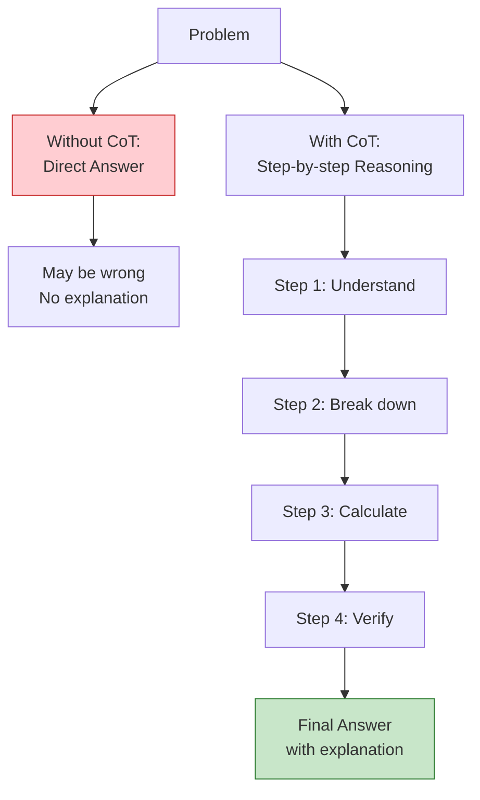
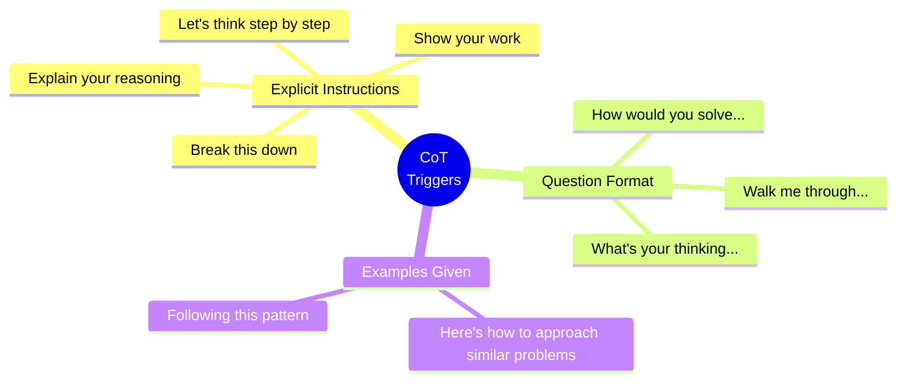
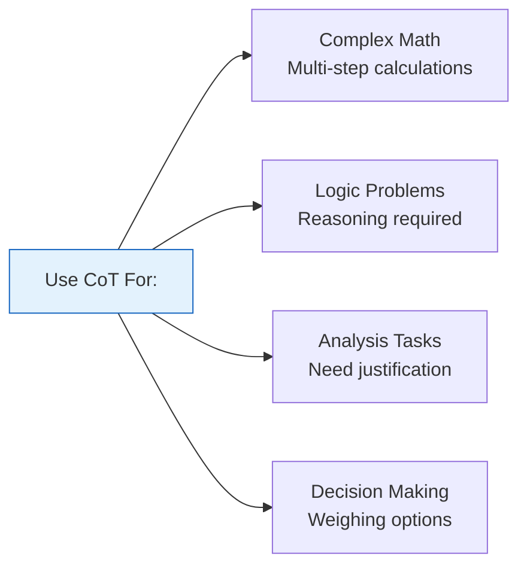
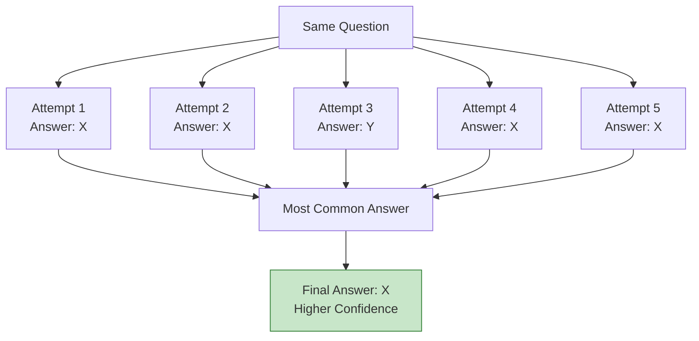
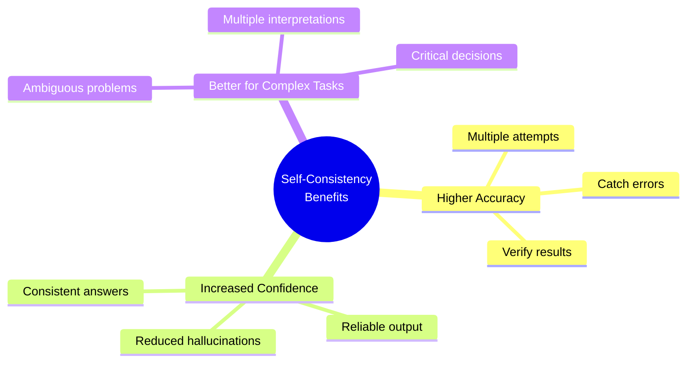
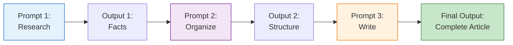
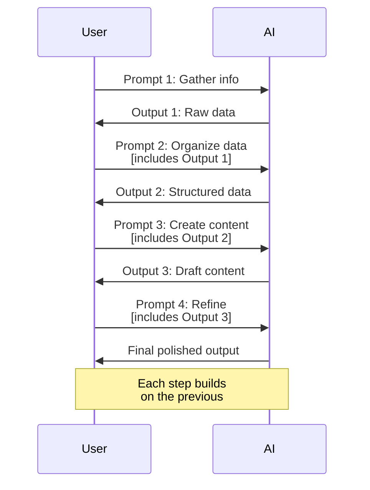
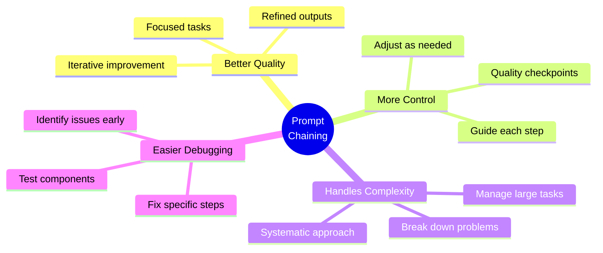
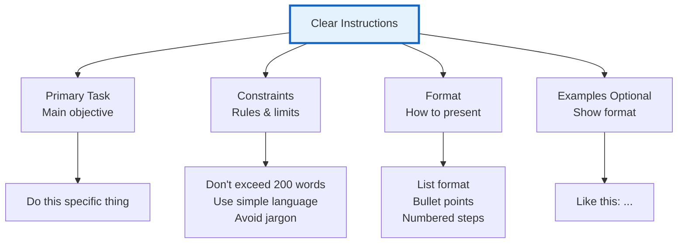
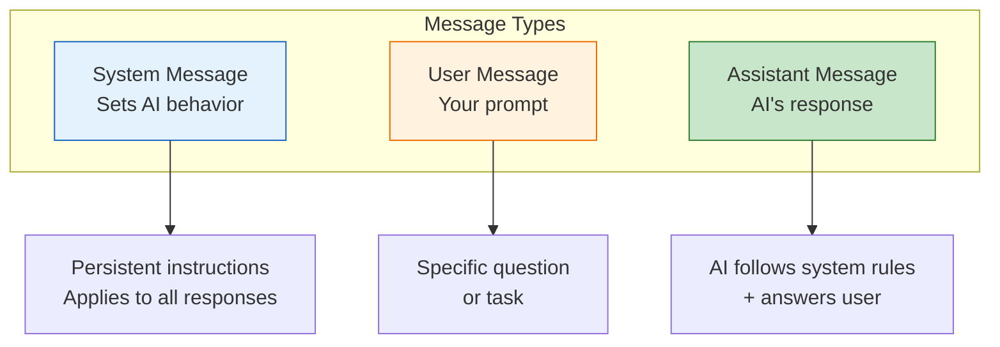

# Week 2 - Class 2: Advanced Prompt Engineering Techniques

## Table of Contents
1. [Chain-of-Thought (CoT) Prompting](#chain-of-thought-cot-prompting)
2. [Self-Consistency](#self-consistency)
3. [Prompt Chaining](#prompt-chaining)
4. [Instruction Following](#instruction-following)
5. [System Messages and Roles](#system-messages-and-roles)
6. [Advanced Formatting Techniques](#advanced-formatting-techniques)
7. [Debugging Bad Prompts](#debugging-bad-prompts)
8. [Industry-Specific Prompting](#industry-specific-prompting)
9. [Ethical Prompting](#ethical-prompting)
10. [Real-World Case Studies](#real-world-case-studies)

---

## Chain-of-Thought (CoT) Prompting

**Chain-of-Thought** prompting encourages AI to show its reasoning step-by-step, leading to more accurate results for complex problems.

### What is Chain-of-Thought?

Instead of jumping to an answer, AI explains its thinking process.



### Example 1: Math Problem

**Without CoT:**
```
Prompt: If I have 15 apples and give away 1/3, how many do I have left?

AI: 10 apples
```

**With CoT:**
```
Prompt: If I have 15 apples and give away 1/3, how many do I have left?
Let's solve this step by step:

AI Response:
Let me think through this step by step:
1. Total apples: 15
2. Fraction to give away: 1/3
3. Calculate 1/3 of 15: 15 ÷ 3 = 5 apples
4. Apples given away: 5
5. Apples remaining: 15 - 5 = 10

Answer: 10 apples
```

### Example 2: Logic Problem

```
Prompt: A bat and ball cost $1.10 together. The bat costs $1.00 more
than the ball. How much does the ball cost? Think step by step.

AI Response:
Let me work through this carefully:

Step 1: Set up variables
- Let ball cost = x
- Then bat cost = x + $1.00

Step 2: Write equation
- Ball + Bat = $1.10
- x + (x + $1.00) = $1.10

Step 3: Solve
- 2x + $1.00 = $1.10
- 2x = $0.10
- x = $0.05

Step 4: Verify
- Ball: $0.05
- Bat: $0.05 + $1.00 = $1.05
- Total: $0.05 + $1.05 = $1.10 ✓

Answer: The ball costs $0.05 (5 cents)
```

### CoT Trigger Phrases:



### When to Use CoT:



---

## Self-Consistency

**Self-Consistency** involves asking AI to solve the same problem multiple times and selecting the most common answer.

### How it Works:



### Example:

```
Prompt: Solve this problem 3 different ways and compare answers:

A farmer has 17 sheep. All but 9 die. How many are left?

AI Response:

Approach 1 - Direct interpretation:
- Total sheep: 17
- "All but 9 die" means 9 survive
- Answer: 9 sheep

Approach 2 - Alternative reading:
- If we read "all but 9" as "17 - 9"
- That would be 8
- But the phrase means "except 9"
- Answer: 9 sheep

Approach 3 - Verification:
- Sheep that died: 17 - 9 = 8
- Sheep remaining alive: 9
- Answer: 9 sheep

Consistent answer across all approaches: 9 sheep
```

### Benefits of Self-Consistency:



---

## Prompt Chaining

**Prompt Chaining** means breaking complex tasks into a sequence of simpler prompts, where each output feeds into the next.

### Visual Representation:



### Example: Writing a Blog Post

**Instead of one complex prompt, break it down:**

```
Prompt 1: Research Phase
---
List 5 key benefits of meditation for mental health.
Include one scientific study for each.

[Get Output 1]

Prompt 2: Structure Phase
---
Using these 5 benefits: [paste Output 1]
Create a blog post outline with:
- Engaging title
- Introduction hook
- 5 main sections (one per benefit)
- Conclusion with call-to-action

[Get Output 2]

Prompt 3: Writing Phase
---
Using this outline: [paste Output 2]
Write the introduction (150 words) in a friendly,
conversational tone for wellness enthusiasts.

[Get Output 3]

Prompt 4: Enhancement Phase
---
Review this introduction: [paste Output 3]
Add one compelling statistic in the first paragraph
and make the hook more engaging.

[Final Output]
```

### Chaining Workflow:



### Benefits of Chaining:



---

## Instruction Following

Make your instructions crystal clear and unambiguous.

### Instruction Hierarchy:



### Example: Precise Instructions

**Weak Instructions:**
```
Write about healthy eating
```

**Strong Instructions:**
```
Task: Write a beginner's guide to healthy eating

Requirements:
1. Target audience: College students with limited cooking experience
2. Length: Exactly 5 tips, each 30-40 words
3. Format: Numbered list with bold tip titles
4. Include: One budget-friendly aspect per tip
5. Tone: Encouraging and practical, not preachy
6. Avoid: Complex nutrition terms, expensive ingredients

Example format:
1. **Tip Title**: Explanation here (30-40 words, mention cost-saving)
```

---

## System Messages and Roles

### Understanding System, User, and Assistant Messages:



### System Message Examples:

**Example 1: Code Helper**
```
System: You are an expert Python developer. Always:
- Provide clean, well-commented code
- Include error handling
- Explain your approach briefly
- Suggest best practices

User: Write a function to validate email addresses