# Week 3 - Class 1: AI Tools Deep Dive

## Table of Contents
1. [Introduction to AI Tools](#introduction-to-ai-tools)
2. [ChatGPT - OpenAI's Flagship](#chatgpt---openais-flagship)
3. [Google Gemini](#google-gemini)
4. [Claude - Anthropic's AI](#claude---anthropics-ai)
5. [Comparing Major AI Tools](#comparing-major-ai-tools)
6. [How to Choose the Right Tool](#how-to-choose-the-right-tool)
7. [Getting Started Guide](#getting-started-guide)
8. [Hands-on Practice](#hands-on-practice)
9. [Tips & Best Practices](#tips--best-practices)

---

## Introduction to AI Tools

AI tools are applications powered by Large Language Models that help us with various tasks like writing, coding, research, and problem-solving.

### Why Learn AI Tools?

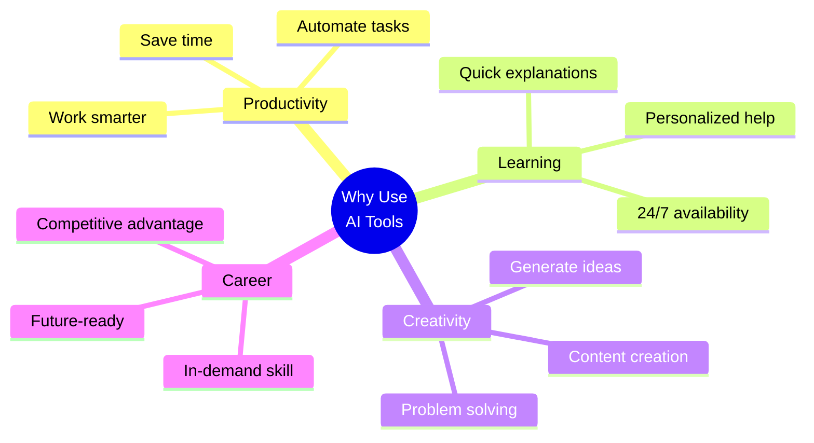

### Popular AI Tools Landscape:

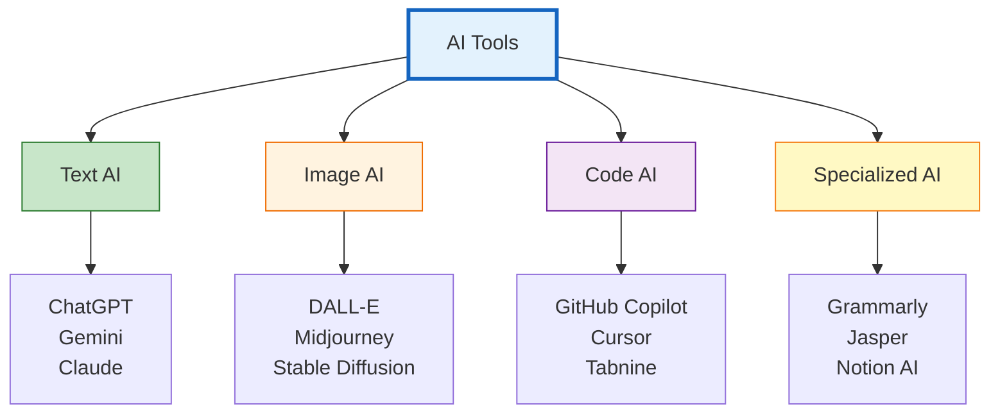

---

## ChatGPT - OpenAI's Flagship

**ChatGPT** is one of the most popular AI chatbots, developed by OpenAI. It can understand and generate human-like text.

### What is ChatGPT?

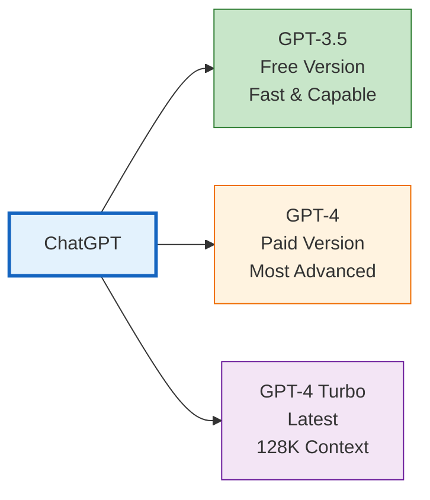

### ChatGPT Capabilities:

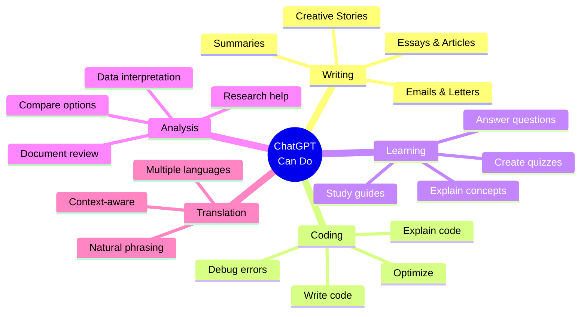

### ChatGPT Versions Comparison:

| Feature | GPT-3.5 (Free) | GPT-4 (Paid) |
|---------|----------------|--------------|
| **Speed** | Very Fast | Moderate |
| **Accuracy** | Good | Excellent |
| **Context** | 4K tokens | 8K / 32K / 128K |
| **Reasoning** | Good | Superior |
| **Creativity** | Good | Excellent |
| **Cost** | Free | $20/month |
| **Best For** | Quick tasks | Complex work |

### How to Use ChatGPT:

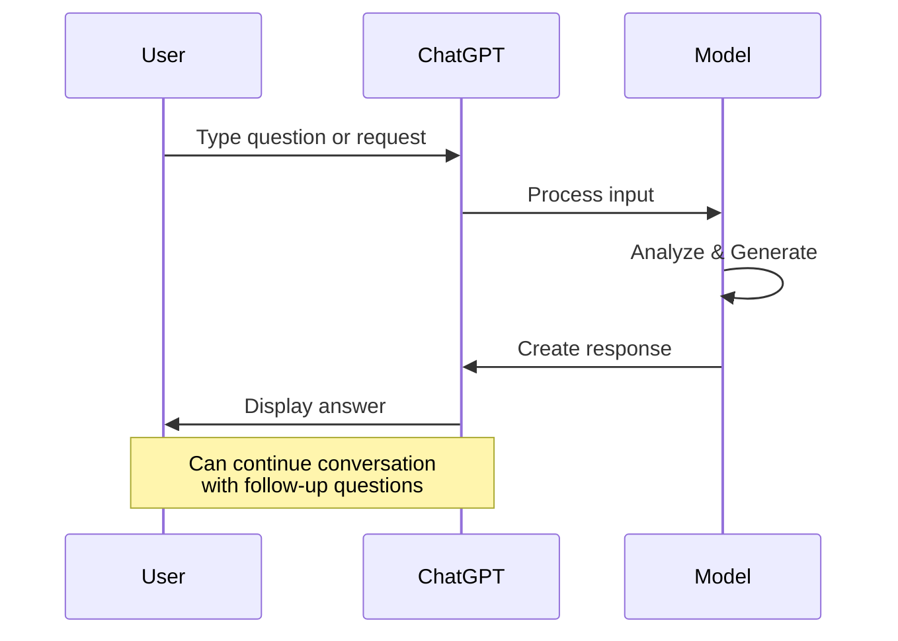

### ChatGPT Use Cases:

**1. Learning Assistant:**
```
Prompt: "Explain photosynthesis in simple terms for a 10-year-old"

ChatGPT will provide:
- Simple explanation
- Easy-to-understand examples
- Avoid complex terminology
```

**2. Writing Helper:**
```
Prompt: "Write a professional email to request a meeting with my professor"

ChatGPT will generate:
- Polite, professional tone
- Clear purpose
- Appropriate formatting
```

**3. Code Helper:**
```
Prompt: "Write a Python function to check if a number is prime"

ChatGPT will provide:
- Working code
- Comments explaining logic
- Example usage
```

### ChatGPT Strengths:

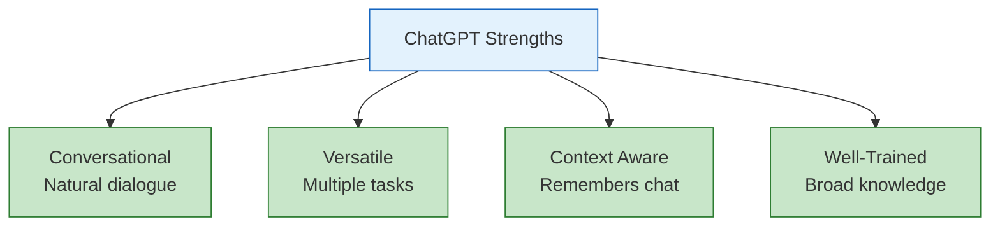

---

## Google Gemini

**Google Gemini** (formerly Bard) is Google's AI chatbot that integrates with Google's ecosystem.

### What is Gemini?

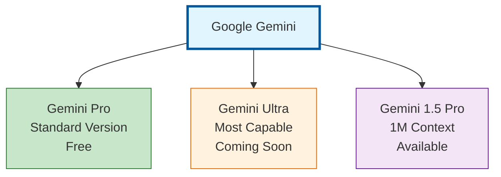

### Gemini Special Features:

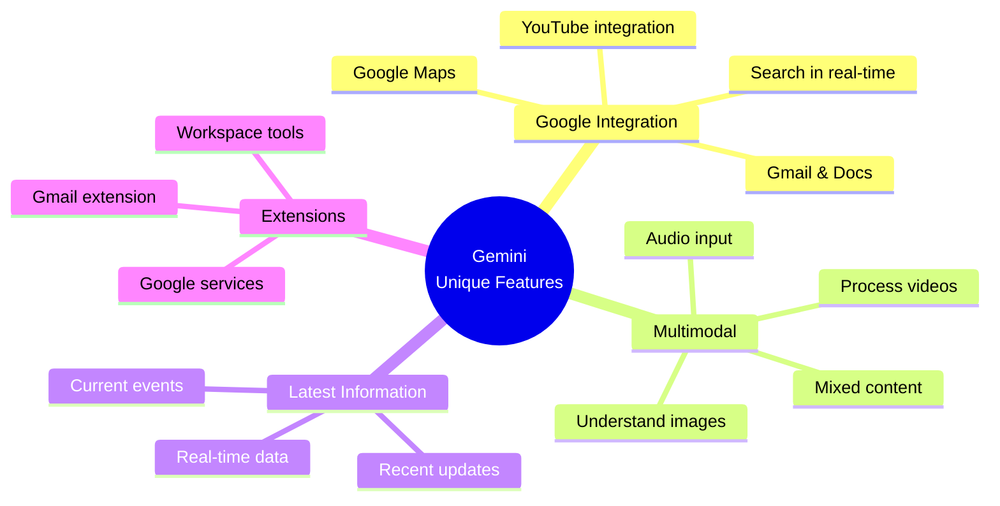

### Gemini vs ChatGPT:

| Feature | Google Gemini | ChatGPT |
|---------|---------------|---------|
| **Real-time Search** | ✅ Yes | ❌ No (GPT-3.5/4) |
| **Image Understanding** | ✅ Yes | ✅ Yes (GPT-4) |
| **Free Access** | ✅ Yes | ✅ Yes (GPT-3.5) |
| **Context Window** | 32K - 1M | 4K - 128K |
| **Google Integration** | ✅ Strong | ❌ No |
| **Current Information** | ✅ Yes | ❌ Limited |

### When to Use Gemini:

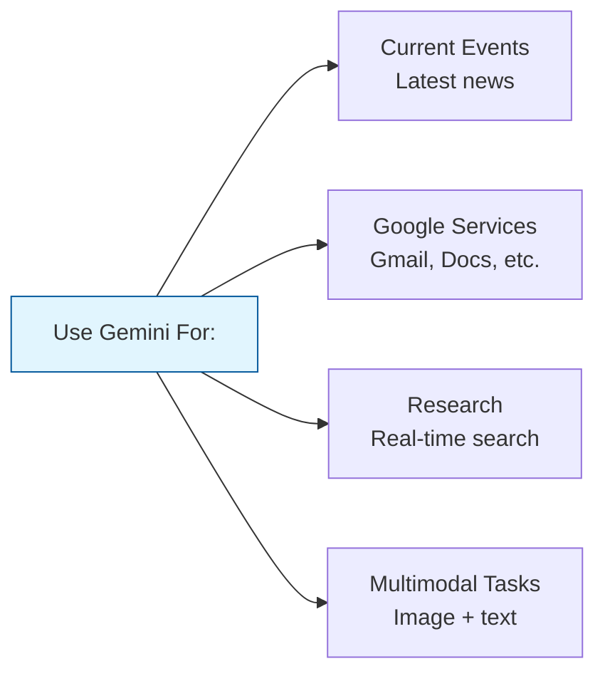

### Gemini Example Use:

**Finding Recent Information:**
```
Prompt: "What are the latest developments in AI this month?"

Gemini will:
- Search current information
- Provide recent updates
- Include sources/links
```

**Image Analysis:**
```
Upload an image + Prompt: "What's in this image and suggest improvements"

Gemini will:
- Describe the image
- Analyze content
- Provide suggestions
```

---

## Claude - Anthropic's AI

**Claude** is an AI assistant created by Anthropic, known for being helpful, harmless, and honest.

### What is Claude?

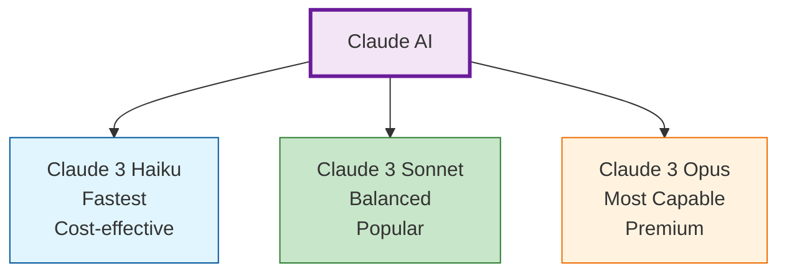

### Claude's Strengths:

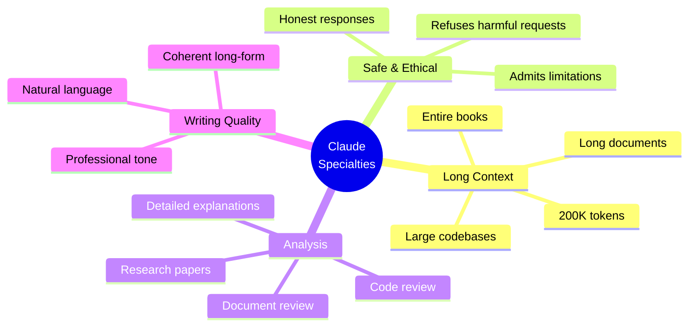

### Claude Comparison:

| Feature | Claude 3 Haiku | Claude 3 Sonnet | Claude 3 Opus |
|---------|----------------|-----------------|---------------|
| **Speed** | Fastest | Fast | Moderate |
| **Context** | 200K | 200K | 200K |
| **Capability** | Good | Better | Best |
| **Cost** | Lowest | Medium | Highest |
| **Best For** | Quick tasks | General use | Complex work |

### When to Use Claude:

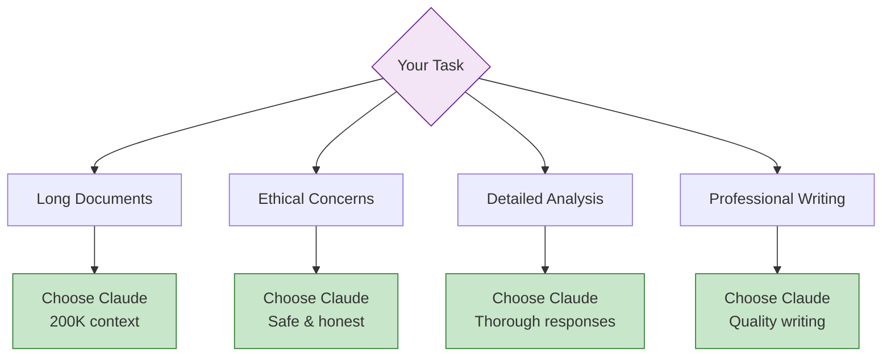

### Claude Example Use:

**Analyzing Long Documents:**
```
Upload a 100-page research paper + Prompt:
"Summarize key findings and methodology"

Claude will:
- Read entire document
- Extract main points
- Organize findings
- Provide detailed summary
```

---

## Comparing Major AI Tools

### Side-by-Side Comparison:

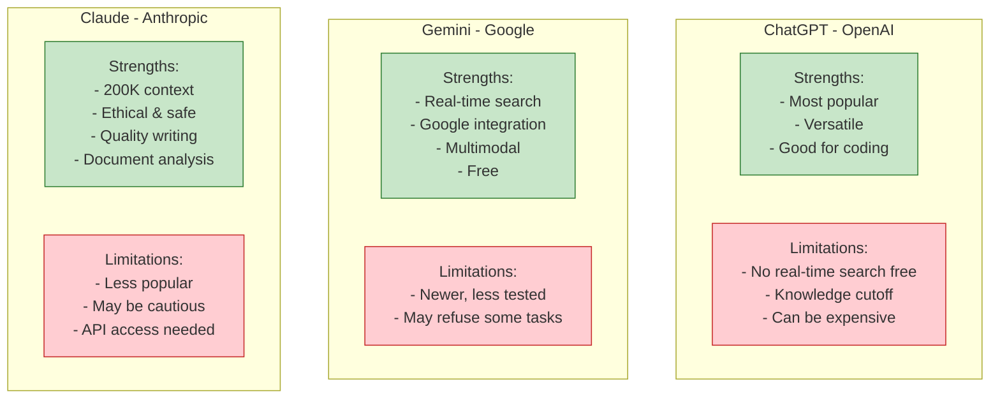

### Feature Comparison Matrix:

| Feature | ChatGPT | Gemini | Claude |
|---------|---------|--------|--------|
| **Free Access** | ✅ GPT-3.5 | ✅ Yes | ⚠️ Limited |
| **Real-time Search** | ❌ | ✅ | ❌ |
| **Context Window** | 4K - 128K | 32K - 1M | 200K |
| **Multimodal** | ✅ GPT-4 | ✅ | ✅ |
| **Code Generation** | ⭐⭐⭐⭐⭐ | ⭐⭐⭐⭐ | ⭐⭐⭐⭐ |
| **Writing Quality** | ⭐⭐⭐⭐ | ⭐⭐⭐⭐ | ⭐⭐⭐⭐⭐ |
| **Document Analysis** | ⭐⭐⭐ | ⭐⭐⭐⭐ | ⭐⭐⭐⭐⭐ |
| **Current Information** | ⭐⭐ | ⭐⭐⭐⭐⭐ | ⭐⭐ |

---

## How to Choose the Right Tool

### Decision Tree:

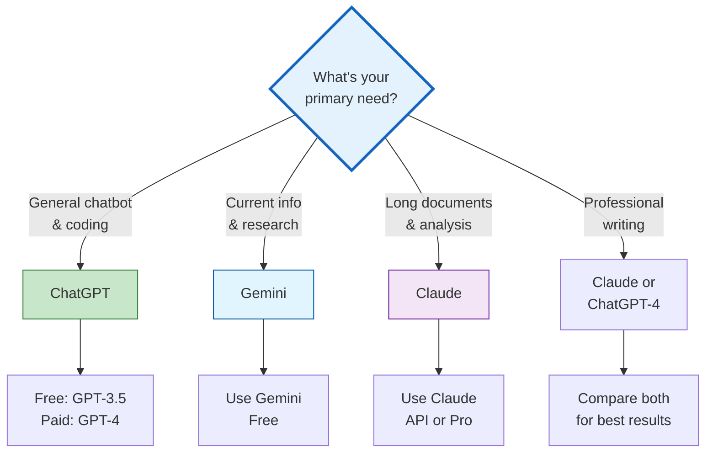

### Use Case Recommendations:

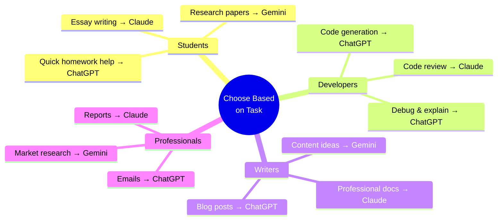

---

## Getting Started Guide

### Setting Up ChatGPT:

**Step 1: Create Account**
```
1. Go to: https://chat.openai.com
2. Click "Sign up"
3. Use email or Google/Microsoft account
4. Verify email
5. Start chatting!
```

**Step 2: Your First Prompt**
```
Try: "Explain what you can help me with in simple terms"
```

### Setting Up Google Gemini:

**Step 1: Access Gemini**
```
1. Go to: https://gemini.google.com
2. Sign in with Google account
3. Start using immediately
```

**Step 2: Try Features**
```
- Ask a current events question
- Upload an image for analysis
- Use Google Workspace extension
```

### Setting Up Claude:

**Step 1: Get Access**
```
1. Go to: https://claude.ai
2. Sign up for an account
3. Choose plan (Free/Pro/API)
```

**Step 2: Test Capabilities**
```
- Upload a long document
- Ask for detailed analysis
- Try complex reasoning tasks
```

---

## Hands-on Practice

### Exercise 1: Compare Responses

**Task:** Ask the same question to all three tools and compare:

```
Prompt: "Explain blockchain technology in 3 paragraphs
for someone with no technical background"

Try on:
- ChatGPT
- Gemini
- Claude

Compare:
- Clarity
- Depth
- Examples used
- Tone
```

### Exercise 2: Tool-Specific Tasks

**For ChatGPT:**
```
1. Generate a Python function to sort a list
2. Explain your code step by step
3. Add error handling
```

**For Gemini:**
```
1. "What are the latest AI news from this week?"
2. Upload a screenshot and ask for analysis
3. Ask about a recent event
```

**For Claude:**
```
1. Upload a 10-page PDF
2. "Summarize the main arguments and provide critique"
3. "Create a table comparing key points"
```

### Exercise 3: Real-World Application

**Scenario:** You need to write a blog post about AI

```
Step 1 - Research (Gemini):
"Find latest trends in AI for 2024"

Step 2 - Outline (ChatGPT):
"Create a detailed outline for a blog post on: [topic from Step 1]"

Step 3 - Write (Claude):
"Write a professional 800-word blog post based on this outline: [paste outline]"

Step 4 - Refine (ChatGPT):
"Review this article and suggest improvements for SEO"
```

---

## Tips & Best Practices

### General Tips for All Tools:

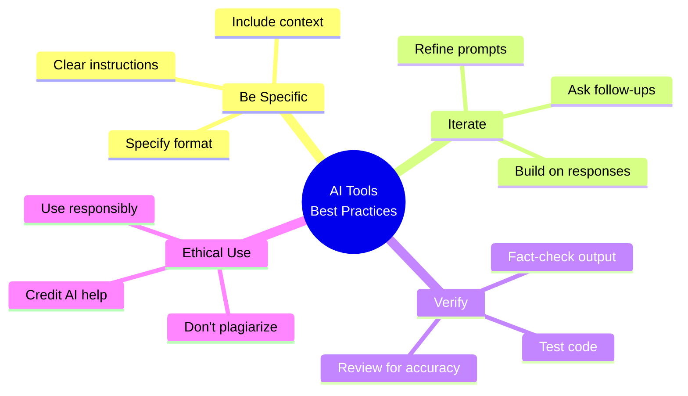

### Do's and Don'ts:

| ✅ DO | ❌ DON'T |
|------|----------|
| Provide context | Give vague prompts |
| Fact-check responses | Trust blindly |
| Use for learning | Use for cheating |
| Iterate on prompts | Give up after one try |
| Combine tools | Rely on just one |
| Credit AI help | Claim as 100% yours |

### Maximizing Each Tool:

**ChatGPT Best For:**
- Coding assistance
- Creative writing
- Quick Q&A
- Tutorials

**Gemini Best For:**
- Current information
- Research starting point
- Image analysis
- Google integration tasks

**Claude Best For:**
- Long document review
- Professional writing
- Ethical concerns
- Detailed analysis

---

## Summary: Tool Selection Guide

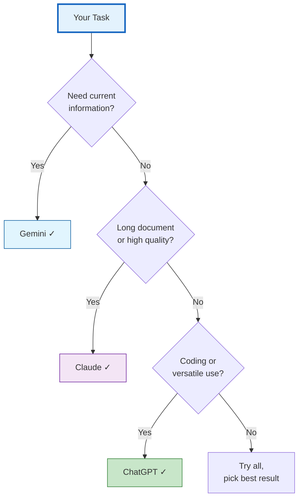

---

## Key Takeaways

1. **Different tools have different strengths** - Choose based on your task
2. **ChatGPT** is versatile and great for coding and general use
3. **Gemini** excels at current information and Google integration
4. **Claude** is best for long documents and high-quality writing
5. **Combine tools** for best results on complex projects
6. **Always verify** AI-generated content
7. **Practice** with each tool to understand their capabilities

---

## Next Class Preview

In **Class 2**, we will learn:
- **AI for Productivity** - Boost your workflow
- **Industry-Specific Applications** - AI in different fields
- **Building AI-Powered Workflows** - Automation tips
- **Practical Projects** - Real-world applications
- **Advanced Features** - Power user techniques

---

**Happy Exploring!**

*Try each tool and find your favorites!*
