# Week 3 - Class 2: AI for Productivity & Real Applications

## Table of Contents
1. [AI for Productivity](#ai-for-productivity)
2. [AI in Different Industries](#ai-in-different-industries)
3. [Building AI Workflows](#building-ai-workflows)
4. [AI-Powered Tools Ecosystem](#ai-powered-tools-ecosystem)
5. [Practical Project Examples](#practical-project-examples)
6. [Advanced Features & Techniques](#advanced-features--techniques)
7. [Common Challenges & Solutions](#common-challenges--solutions)
8. [Future of AI Tools](#future-of-ai-tools)

---

## AI for Productivity

Learn how to use AI to dramatically increase your productivity across different tasks.

### Productivity Boost Areas:

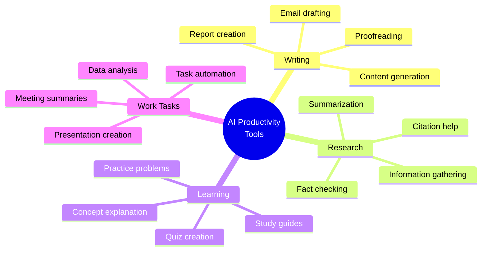
```mermaid
mindmap
  root((AI Productivity<br/>Tools))
    Writing
      Email drafting
      Report creation
      Content generation
      Proofreading
    Research
      Information gathering
      Summarization
      Fact checking
      Citation help
    Learning
      Concept explanation
      Study guides
      Quiz creation
      Practice problems
    Work Tasks
      Data analysis
      Presentation creation
      Meeting summaries
      Task automation
```

### Time Savings with AI:

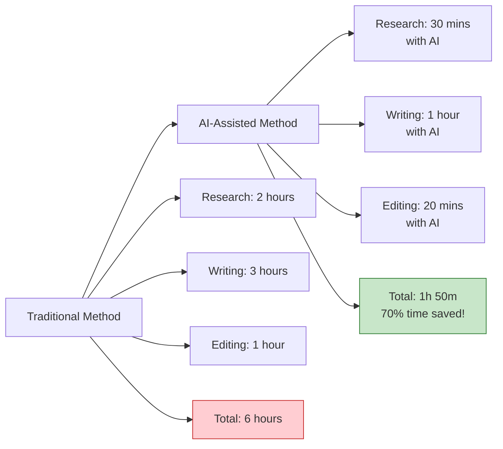
```mermaid
graph LR
    A[Traditional Method] --> B[AI-Assisted Method]

    A --> A1[Research: 2 hours]
    A --> A2[Writing: 3 hours]
    A --> A3[Editing: 1 hour]
    A --> A4[Total: 6 hours]

    B --> B1[Research: 30 mins<br/>with AI]
    B --> B2[Writing: 1 hour<br/>with AI]
    B --> B3[Editing: 20 mins<br/>with AI]
    B --> B4[Total: 1h 50m<br/>70% time saved!]

    style A4 fill:#ffcdd2,stroke:#c62828
    style B4 fill:#c8e6c9,stroke:#2e7d32
```

### Productivity Workflows:

**1. Email Management:**

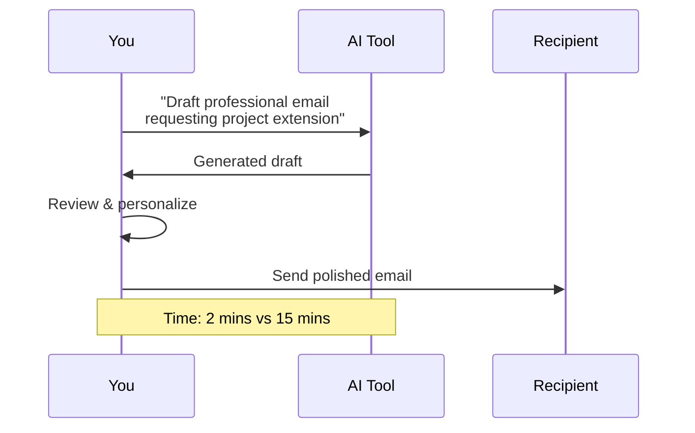
```mermaid
sequenceDiagram
    participant Y as You
    participant AI as AI Tool
    participant R as Recipient

    Y->>AI: "Draft professional email<br/>requesting project extension"
    AI->>Y: Generated draft
    Y->>Y: Review & personalize
    Y->>R: Send polished email

    Note over Y,AI: Time: 2 mins vs 15 mins
```

**Example Prompt:**
```
Context: I'm a student who needs a 2-day extension on my assignment
due to illness.

Task: Write a professional email to my professor requesting extension.

Tone: Polite, respectful, concise
Length: 3 short paragraphs
```

**2. Content Creation Workflow:**

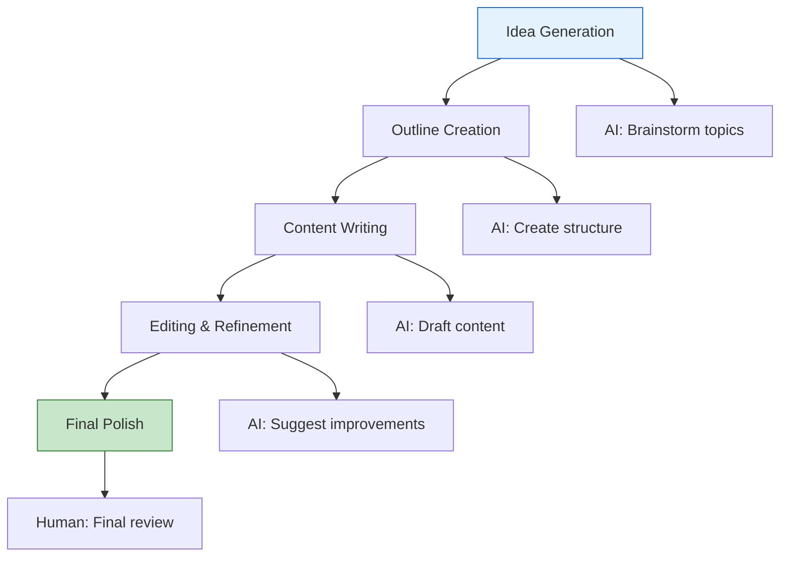
```mermaid
graph TD
    A[Idea Generation] --> B[Outline Creation]
    B --> C[Content Writing]
    C --> D[Editing & Refinement]
    D --> E[Final Polish]

    A --> A1[AI: Brainstorm topics]
    B --> B1[AI: Create structure]
    C --> C1[AI: Draft content]
    D --> D1[AI: Suggest improvements]
    E --> E1[Human: Final review]

    style A fill:#e3f2fd,stroke:#1565c0
    style E fill:#c8e6c9,stroke:#2e7d32
```

**3. Learning Accelerator:**

```
Step 1: Concept Understanding
Prompt: "Explain [concept] in simple terms with examples"

Step 2: Deep Dive
Prompt: "Now explain the technical details of [concept]"

Step 3: Practice
Prompt: "Create 5 practice questions on [concept] with answers"

Step 4: Application
Prompt: "Give me a real-world scenario to apply [concept]"
```

---

## AI in Different Industries

See how AI is transforming various industries with real applications.

### Industry Applications Map:

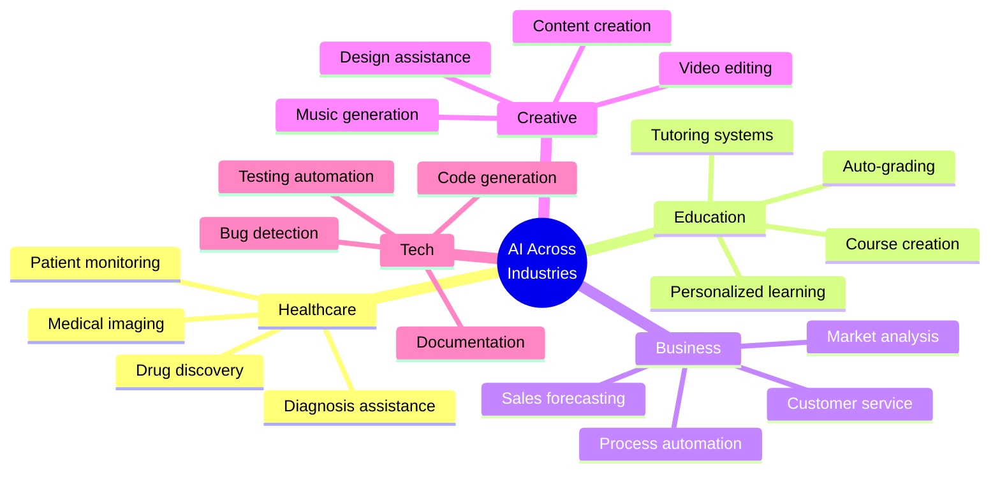
```mermaid
mindmap
  root((AI Across<br/>Industries))
    Healthcare
      Diagnosis assistance
      Drug discovery
      Patient monitoring
      Medical imaging
    Education
      Personalized learning
      Auto-grading
      Tutoring systems
      Course creation
    Business
      Customer service
      Market analysis
      Sales forecasting
      Process automation
    Creative
      Content creation
      Design assistance
      Music generation
      Video editing
    Tech
      Code generation
      Bug detection
      Testing automation
      Documentation
```

### 1. Healthcare AI:

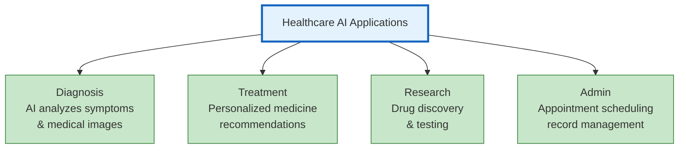
```mermaid
graph TB
    A[Healthcare AI Applications]

    A --> B[Diagnosis<br/>AI analyzes symptoms<br/>& medical images]
    A --> C[Treatment<br/>Personalized medicine<br/>recommendations]
    A --> D[Research<br/>Drug discovery<br/>& testing]
    A --> E[Admin<br/>Appointment scheduling<br/>record management]

    style A fill:#e3f2fd,stroke:#1565c0,stroke-width:3px
    style B fill:#c8e6c9,stroke:#2e7d32
    style C fill:#c8e6c9,stroke:#2e7d32
    style D fill:#c8e6c9,stroke:#2e7d32
    style E fill:#c8e6c9,stroke:#2e7d32
```

**Real Example:**
- **PathAI**: Uses AI to help pathologists detect cancer
- **ChatGPT in Healthcare**: Helps explain medical terms to patients
- **Gemini**: Assists in medical research literature review

### 2. Education AI:

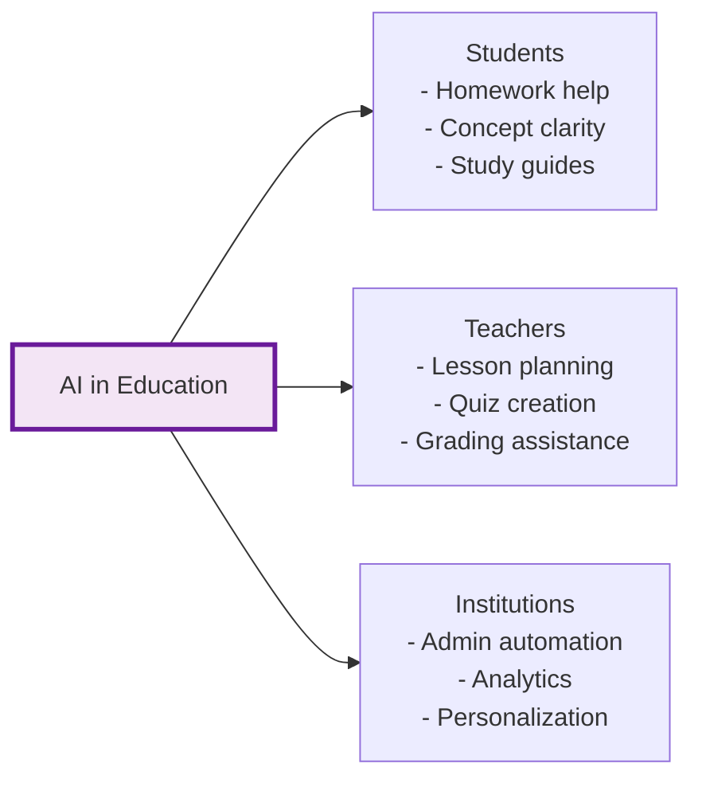
```mermaid
graph LR
    A[AI in Education]

    A --> B[Students<br/>- Homework help<br/>- Concept clarity<br/>- Study guides]
    A --> C[Teachers<br/>- Lesson planning<br/>- Quiz creation<br/>- Grading assistance]
    A --> D[Institutions<br/>- Admin automation<br/>- Analytics<br/>- Personalization]

    style A fill:#f3e5f5,stroke:#6a1b9a,stroke-width:3px
```

**Practical Uses:**

For Students:
```
Prompt: "I'm learning algebra. Explain slope-intercept form
with 3 real-world examples"
```

For Teachers:
```
Prompt: "Create a 10-question multiple choice quiz on
World War 2 for high school students, with answer key"
```

### 3. Business & Marketing:

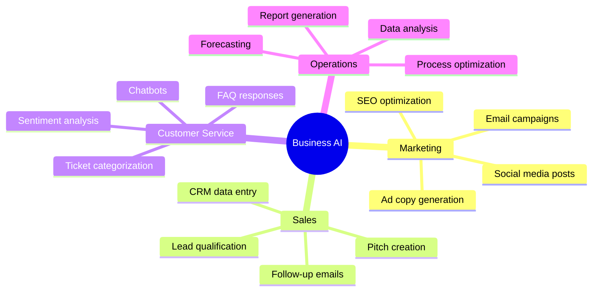
```mermaid
mindmap
  root((Business AI))
    Marketing
      Ad copy generation
      Social media posts
      Email campaigns
      SEO optimization
    Sales
      Lead qualification
      Pitch creation
      Follow-up emails
      CRM data entry
    Customer Service
      Chatbots
      FAQ responses
      Ticket categorization
      Sentiment analysis
    Operations
      Report generation
      Data analysis
      Process optimization
      Forecasting
```

**Example Workflow - Marketing Campaign:**

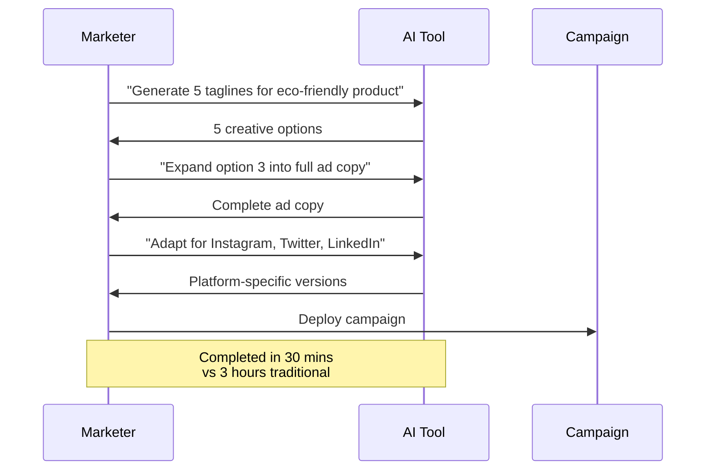
```mermaid
sequenceDiagram
    participant M as Marketer
    participant AI as AI Tool
    participant C as Campaign

    M->>AI: "Generate 5 taglines for eco-friendly product"
    AI->>M: 5 creative options
    M->>AI: "Expand option 3 into full ad copy"
    AI->>M: Complete ad copy
    M->>AI: "Adapt for Instagram, Twitter, LinkedIn"
    AI->>M: Platform-specific versions
    M->>C: Deploy campaign

    Note over M,AI: Completed in 30 mins<br/>vs 3 hours traditional
```

### 4. Software Development:

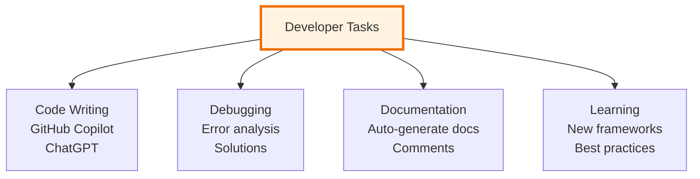
```mermaid
graph TD
    A[Developer Tasks]

    A --> B[Code Writing<br/>GitHub Copilot<br/>ChatGPT]
    A --> C[Debugging<br/>Error analysis<br/>Solutions]
    A --> D[Documentation<br/>Auto-generate docs<br/>Comments]
    A --> E[Learning<br/>New frameworks<br/>Best practices]

    style A fill:#fff3e0,stroke:#ef6c00,stroke-width:3px
```

**Developer Workflow:**

```
Task: Build a REST API endpoint

Step 1: Design
Prompt: "Design REST API endpoints for a blog system
with CRUD operations. List all endpoints with methods"

Step 2: Implementation
Prompt: "Write Express.js code for GET /posts endpoint
with pagination and filtering"

Step 3: Testing
Prompt: "Write unit tests for this function: [paste code]"

Step 4: Documentation
Prompt: "Generate API documentation for these endpoints"
```

---

## Building AI Workflows

Create efficient workflows that combine multiple AI tools and techniques.

### Workflow Framework:

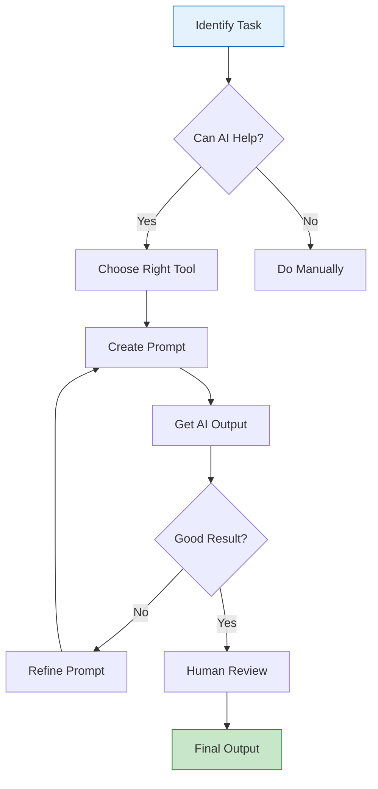
```mermaid
graph TB
    A[Identify Task] --> B{Can AI Help?}
    B -->|Yes| C[Choose Right Tool]
    B -->|No| D[Do Manually]

    C --> E[Create Prompt]
    E --> F[Get AI Output]
    F --> G{Good Result?}

    G -->|No| H[Refine Prompt]
    H --> E

    G -->|Yes| I[Human Review]
    I --> J[Final Output]

    style A fill:#e3f2fd,stroke:#1565c0
    style J fill:#c8e6c9,stroke:#2e7d32
```

### Multi-Tool Workflows:

**Example 1: Research Paper Writing**

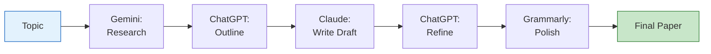
```mermaid
graph LR
    A[Topic] --> B[Gemini:<br/>Research]
    B --> C[ChatGPT:<br/>Outline]
    C --> D[Claude:<br/>Write Draft]
    D --> E[ChatGPT:<br/>Refine]
    E --> F[Grammarly:<br/>Polish]
    F --> G[Final Paper]

    style A fill:#e3f2fd,stroke:#1565c0
    style G fill:#c8e6c9,stroke:#2e7d32
```

**Example 2: Social Media Content Calendar**

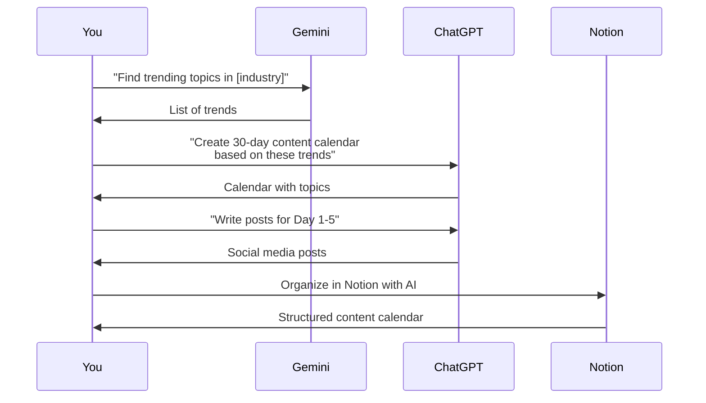
```mermaid
sequenceDiagram
    participant Y as You
    participant G as Gemini
    participant C as ChatGPT
    participant N as Notion

    Y->>G: "Find trending topics in [industry]"
    G->>Y: List of trends

    Y->>C: "Create 30-day content calendar<br/>based on these trends"
    C->>Y: Calendar with topics

    Y->>C: "Write posts for Day 1-5"
    C->>Y: Social media posts

    Y->>N: Organize in Notion with AI
    N->>Y: Structured content calendar
```

### Automation Ideas:

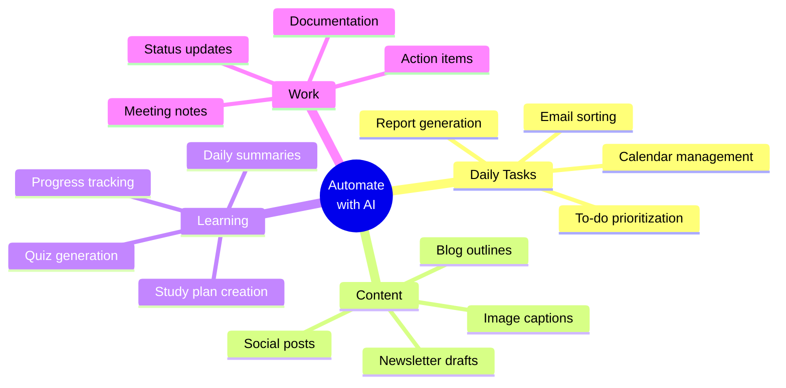
```mermaid
mindmap
  root((Automate<br/>with AI))
    Daily Tasks
      Email sorting
      Calendar management
      To-do prioritization
      Report generation
    Content
      Social posts
      Blog outlines
      Newsletter drafts
      Image captions
    Learning
      Daily summaries
      Quiz generation
      Study plan creation
      Progress tracking
    Work
      Meeting notes
      Action items
      Status updates
      Documentation
```

---

## AI-Powered Tools Ecosystem

Explore specialized AI tools for specific tasks.

### Tool Categories:

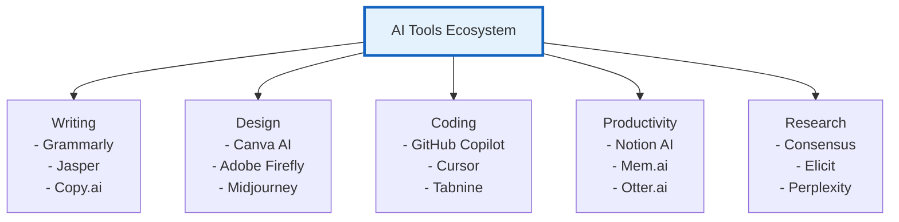
```mermaid
graph TB
    A[AI Tools Ecosystem]

    A --> B[Writing<br/>- Grammarly<br/>- Jasper<br/>- Copy.ai]
    A --> C[Design<br/>- Canva AI<br/>- Adobe Firefly<br/>- Midjourney]
    A --> D[Coding<br/>- GitHub Copilot<br/>- Cursor<br/>- Tabnine]
    A --> E[Productivity<br/>- Notion AI<br/>- Mem.ai<br/>- Otter.ai]
    A --> F[Research<br/>- Consensus<br/>- Elicit<br/>- Perplexity]

    style A fill:#e3f2fd,stroke:#1565c0,stroke-width:3px
```

### Specialized Tools Overview:

| Tool | Purpose | Best For |
|------|---------|----------|
| **Grammarly** | Writing assistant | Grammar, tone, clarity |
| **Jasper** | Content creation | Marketing copy, blogs |
| **GitHub Copilot** | Code completion | Programming assistance |
| **Notion AI** | Knowledge management | Notes, docs, wikis |
| **Otter.ai** | Transcription | Meeting notes, interviews |
| **Perplexity** | Research | Cited answers, sources |
| **Canva AI** | Design | Graphics, presentations |

### Choosing Specialized Tools:

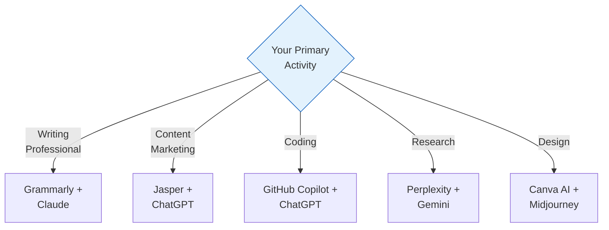
```mermaid
graph TD
    A{Your Primary<br/>Activity}

    A -->|Writing<br/>Professional| B[Grammarly +<br/>Claude]
    A -->|Content<br/>Marketing| C[Jasper +<br/>ChatGPT]
    A -->|Coding| D[GitHub Copilot +<br/>ChatGPT]
    A -->|Research| E[Perplexity +<br/>Gemini]
    A -->|Design| F[Canva AI +<br/>Midjourney]

    style A fill:#e3f2fd,stroke:#1565c0
```

---

## Practical Project Examples

Learn through real-world project examples.

### Project 1: Personal Blog Setup

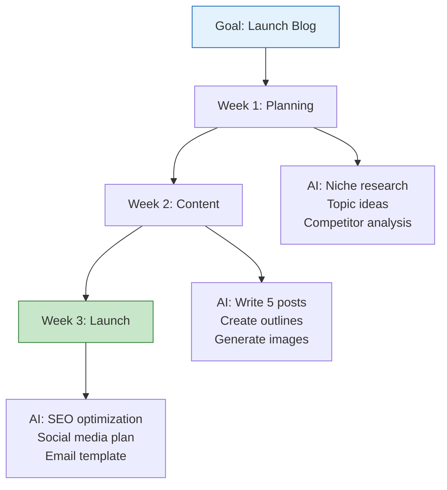
```mermaid
graph TB
    A[Goal: Launch Blog] --> B[Week 1: Planning]
    B --> C[Week 2: Content]
    C --> D[Week 3: Launch]

    B --> B1[AI: Niche research<br/>Topic ideas<br/>Competitor analysis]
    C --> C1[AI: Write 5 posts<br/>Create outlines<br/>Generate images]
    D --> D1[AI: SEO optimization<br/>Social media plan<br/>Email template]

    style A fill:#e3f2fd,stroke:#1565c0
    style D fill:#c8e6c9,stroke:#2e7d32
```

**AI Prompts Used:**
```
1. "Suggest 10 profitable blog niches for beginners in 2024"
2. "Create content calendar for tech blog: 20 post ideas"
3. "Write 800-word article on: [topic]"
4. "Generate SEO meta description for: [article]"
5. "Create promotion plan for new blog post"
```

### Project 2: Job Application Package

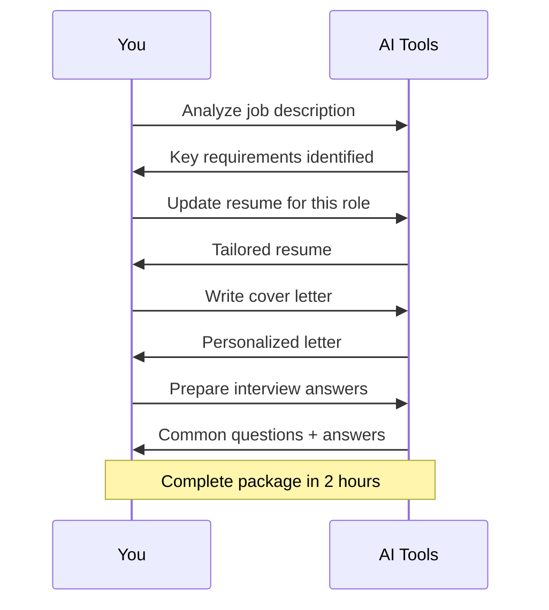
```mermaid
sequenceDiagram
    participant Y as You
    participant AI as AI Tools

    Y->>AI: Analyze job description
    AI->>Y: Key requirements identified

    Y->>AI: Update resume for this role
    AI->>Y: Tailored resume

    Y->>AI: Write cover letter
    AI->>Y: Personalized letter

    Y->>AI: Prepare interview answers
    AI->>Y: Common questions + answers

    Note over Y,AI: Complete package in 2 hours
```

### Project 3: Learning New Skill (Python)

**4-Week AI-Assisted Learning Plan:**

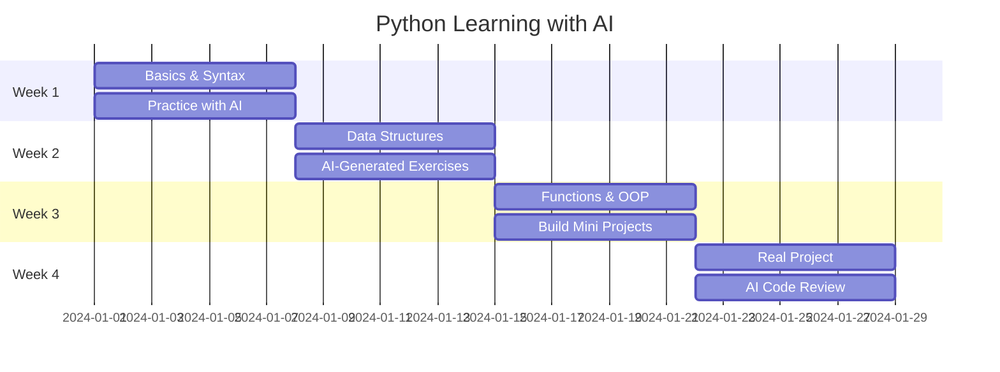
```mermaid
gantt
    title Python Learning with AI
    dateFormat  YYYY-MM-DD
    section Week 1
    Basics & Syntax           :2024-01-01, 7d
    Practice with AI          :2024-01-01, 7d
    section Week 2
    Data Structures           :2024-01-08, 7d
    AI-Generated Exercises    :2024-01-08, 7d
    section Week 3
    Functions & OOP           :2024-01-15, 7d
    Build Mini Projects       :2024-01-15, 7d
    section Week 4
    Real Project              :2024-01-22, 7d
    AI Code Review            :2024-01-22, 7d
```

**Daily AI Prompts:**
```
Day 1: "Teach me Python basics: variables, data types, operators"
Day 2: "Create 10 practice problems on Python variables with solutions"
Day 3: "Explain Python lists with 5 real-world examples"
...
Day 28: "Review this Python project code and suggest improvements"
```

---

## Advanced Features & Techniques

Master advanced AI capabilities for power users.

### Advanced ChatGPT Features:

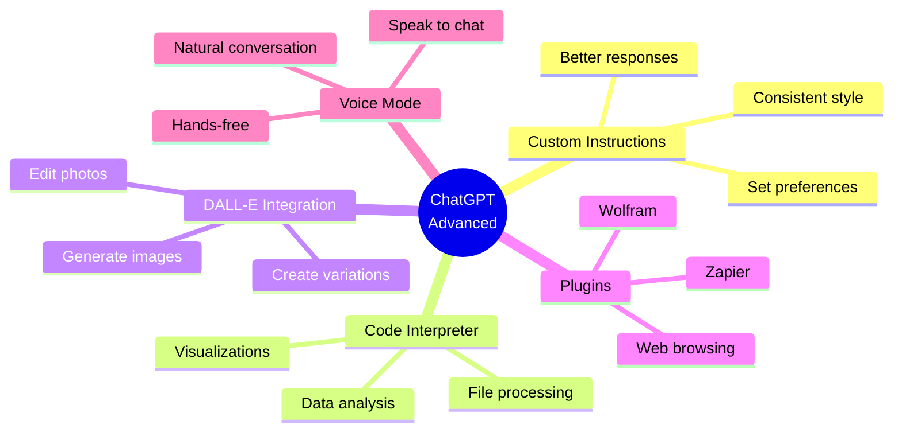
```mermaid
mindmap
  root((ChatGPT<br/>Advanced))
    Custom Instructions
      Set preferences
      Consistent style
      Better responses
    Code Interpreter
      Data analysis
      File processing
      Visualizations
    DALL-E Integration
      Generate images
      Edit photos
      Create variations
    Plugins
      Web browsing
      Zapier
      Wolfram
    Voice Mode
      Speak to chat
      Hands-free
      Natural conversation
```

### Prompt Engineering Mastery:

**Technique 1: Role-Based Prompting**
```
"Act as an expert Python developer with 10 years experience.
Review this code for security vulnerabilities and suggest fixes."
```

**Technique 2: Chain Prompting**
```
Prompt 1: "List steps to build a web app"
Prompt 2: "Expand step 3 with detailed instructions"
Prompt 3: "Write code for the solution in step 3"
```

**Technique 3: Structured Output**
```
"Analyze this product and provide:
- Strengths (3 bullets)
- Weaknesses (3 bullets)
- Recommendation (Yes/No with reason)
- Confidence Score (1-10)"
```

### Power User Workflows:

```mermaid
graph LR
    A[Input] --> B[Pre-process<br/>with AI]
    B --> C[Main AI<br/>Processing]
    C --> D[Post-process<br/>with AI]
    D --> E[Human<br/>Review]
    E --> F[Final Output]

    style A fill:#e3f2fd,stroke:#1565c0
    style C fill:#fff3e0,stroke:#ef6c00
    style F fill:#c8e6c9,stroke:#2e7d32
```

---

## Common Challenges & Solutions

Address frequent issues when using AI tools.

### Challenge-Solution Matrix:

```mermaid
graph TD
    A[Common AI Challenges]

    A --> B[Hallucinations]
    A --> C[Generic Outputs]
    A --> D[Context Loss]
    A --> E[Unexpected Results]

    B --> B1[Solution:<br/>- Verify facts<br/>- Cross-check sources<br/>- Use multiple tools]

    C --> C1[Solution:<br/>- Add more context<br/>- Be specific<br/>- Provide examples]

    D --> D1[Solution:<br/>- Summarize often<br/>- Use Claude for long<br/>- Start fresh if needed]

    E --> E1[Solution:<br/>- Refine prompt<br/>- Try different approach<br/>- Break into steps]

    style A fill:#ffcdd2,stroke:#c62828
    style B1 fill:#c8e6c9,stroke:#2e7d32
    style C1 fill:#c8e6c9,stroke:#2e7d32
    style D1 fill:#c8e6c9,stroke:#2e7d32
    style E1 fill:#c8e6c9,stroke:#2e7d32
```

### Troubleshooting Guide:

| Problem | Quick Fix |
|---------|-----------|
| **Vague response** | Add more context, be specific |
| **Wrong information** | Ask for sources, verify separately |
| **Too long/short** | Specify exact length in prompt |
| **Wrong tone** | Explicitly state desired tone |
| **Forgot context** | Summarize previous discussion |
| **Not creative** | Ask for "unique" or "creative" solutions |

---

## Future of AI Tools

Understand where AI tools are heading.

### Emerging Trends:

```mermaid
mindmap
  root((Future AI<br/>Trends))
    Multimodal
      Text + Image + Audio
      Video understanding
      Unified interface
    Personalization
      Learns your style
      Remembers preferences
      Custom training
    Integration
      OS-level AI
      Cross-app
      API everywhere
    Specialized Agents
      Task-specific AIs
      Industry-focused
      Autonomous workflows
    Real-time
      Instant responses
      Live collaboration
      Continuous learning
```

### What's Coming:

```mermaid
timeline
    title AI Tools Evolution
    2023 : ChatGPT explosion
         : Text-based AI boom
    2024 : Multimodal AI
         : Image + Text integration
         : Longer context windows
    2025 : AI Agents
         : Autonomous task completion
         : Better reasoning
    2026 : Personalized AI
         : Your AI assistant
         : Predictive help
```

---

## Key Takeaways

```mermaid
mindmap
  root((Week 3<br/>Summary))
    Tools Mastered
      ChatGPT
      Gemini
      Claude
    Skills Gained
      Productivity hacks
      Workflow building
      Industry applications
    Best Practices
      Verify outputs
      Combine tools
      Iterate prompts
    Next Steps
      Practice daily
      Build projects
      Explore new tools
```

---

## Week 3 Complete Checklist

- [ ] Tried ChatGPT, Gemini, and Claude
- [ ] Created accounts on all platforms
- [ ] Completed comparison exercises
- [ ] Built at least one AI workflow
- [ ] Used AI for a real task
- [ ] Explored specialized tools
- [ ] Created a productivity system with AI
- [ ] Practiced advanced prompting techniques

---

## Next Steps

After completing Week 3:

1. **Practice Daily** - Use AI tools for real tasks
2. **Build Portfolio** - Create projects using AI
3. **Stay Updated** - Follow AI news and updates
4. **Join Communities** - Connect with AI enthusiasts
5. **Experiment** - Try new tools and techniques

---

## Recommended Resources

### Communities:
- Reddit: r/ChatGPT, r/artificial
- Discord: AI development servers
- Twitter: Follow AI researchers

### Learning:
- OpenAI Blog
- Google AI Blog
- YouTube channels on AI

### Tools to Explore:
- Perplexity AI
- Notion AI
- GitHub Copilot
- Canva AI

---

**Congratulations on completing Week 3!**

*You're now equipped to use AI tools effectively for productivity and real-world applications!*

**Keep exploring, keep learning, keep building!** 🚀
